# Auth System Architecture

```mermaid
graph TB
    subgraph Client ["Client (Browser / SDK)"]
        REQ["HTTP Request<br/>Authorization: Bearer token<br/>Cookie: mastra_session"]
    end

    subgraph ServerAdapter ["Server Adapter (Hono / Express / Fastify / Koa)"]
        direction TB
        CTX["Context Middleware<br/>Sets mastra, requestContext,<br/>customRouteAuthConfig"]

        subgraph PerRouteAuth ["Per-Route Auth (no global middleware)"]
            direction TB
            RA["checkRouteAuth()"]
            RP["checkRoutePermission()"]
        end

        HANDLER["Route Handler<br/>(agents, tools, workflows, etc.)"]

        CTX --> RA
        RA -->|"user + permissions<br/>in requestContext"| RP
        RP -->|"authorized"| HANDLER
    end

    subgraph CoreAuthMiddleware ["coreAuthMiddleware (framework-agnostic)"]
        direction TB
        DEV{"MASTRA_DEV=true?<br/>+ playground header"}
        PROT{"isProtectedPath?<br/>/api/* default"}
        PUB{"canAccessPublicly?<br/>/api, /api/auth/*"}
        AUTH_TOKEN["authenticateToken()<br/>via MastraAuthProvider<br/>or MastraAuthConfig"]
        SET_USER["Store user in<br/>requestContext"]
        LOAD_RBAC["Load permissions & roles<br/>from IRBACProvider"]
        AUTHZ{"Authorization Check<br/>1. authorizeUser()<br/>2. authorize()<br/>3. rules[] (first match wins)<br/>4. default: pass if no RBAC"}

        DEV -->|"skip"| PASS_DEV["Allow (dev)"]
        DEV -->|"no"| PROT
        PROT -->|"not protected"| PASS_UNPROT["Allow"]
        PROT -->|"protected"| PUB
        PUB -->|"public path"| PASS_PUB["Allow"]
        PUB -->|"not public"| AUTH_TOKEN
        AUTH_TOKEN -->|"null"| DENY_401["401 Unauthorized"]
        AUTH_TOKEN -->|"user found"| SET_USER
        SET_USER --> LOAD_RBAC
        LOAD_RBAC --> AUTHZ
        AUTHZ -->|"denied"| DENY_403_A["403 Forbidden"]
        AUTHZ -->|"allowed"| PASS_AUTH["Allow"]
    end

    subgraph PermissionEnforcement ["Route Permission Enforcement"]
        direction TB
        EFF_PERM["getEffectivePermission()"]
        EXPLICIT{"route.requiresPermission<br/>explicitly set?"}
        DERIVE["derivePermission()<br/>extractResource(path) + deriveAction(method)"]
        MATCH["hasPermission()<br/>wildcard matching:<br/>*, resource:*, *:action"]

        EFF_PERM --> EXPLICIT
        EXPLICIT -->|"yes"| MATCH
        EXPLICIT -->|"no"| DERIVE
        DERIVE -->|"e.g. agents:read"| MATCH
        MATCH -->|"no match"| DENY_403_P["403 Missing<br/>required permission"]
        MATCH -->|"match"| PASS_PERM["Allow"]
    end

    subgraph AuthProviders ["Auth Providers"]
        direction TB

        subgraph CompositeAuth ["CompositeAuth"]
            direction LR
            CA_DESC["Tries providers in order<br/>First success wins"]
        end

        subgraph Providers ["Individual Providers (extend MastraAuthProvider)"]
            direction TB
            SIMPLE["SimpleAuth<br/>Token→User map<br/>Dev/testing<br/>License exempt"]
            CLOUD["MastraCloudAuth<br/>OAuth-based<br/>License exempt"]
            EXTERNAL["External Provider<br/>Auth0 / Clerk / Firebase<br/>WorkOS / Supabase / BetterAuth"]
        end

        CompositeAuth --> SIMPLE
        CompositeAuth --> CLOUD
        CompositeAuth --> EXTERNAL
    end

    subgraph CoreInterfaces ["Core Auth Interfaces (@mastra/core/auth)"]
        direction TB

        subgraph Identity ["Identity"]
            IUser["IUserProvider<br/>getCurrentUser(req)<br/>getUser(id)"]
            ISess["ISessionProvider<br/>create / validate / destroy<br/>refresh / getSessionId"]
            ISSO["ISSOProvider<br/>getLoginUrl / handleCallback<br/>login button config"]
            ICred["ICredentialsProvider<br/>signIn / signUp<br/>password reset"]
        end

        subgraph Authorization ["Authorization"]
            IRBAC["IRBACProvider<br/>getRoles / getPermissions<br/>hasPermission / hasRole"]
            IRBACMgr["IRBACManager<br/>extends IRBACProvider<br/>assignRole / removeRole"]
            IACL["IACLProvider<br/>canAccess / listAccessible<br/>filterAccessible"]
            IACLMgr["IACLManager<br/>extends IACLProvider<br/>grant / revoke"]
        end
    end

    subgraph Defaults ["Default Implementations"]
        direction TB
        STATIC_RBAC["StaticRBACProvider<br/>RoleDefinition[] or RoleMapping<br/>Permission cache"]
        MEM_SESS["MemorySessionProvider<br/>In-memory Map<br/>Dev only"]
        COOKIE_SESS["CookieSessionProvider<br/>HMAC-SHA256 signed cookies<br/>No server-side storage"]
        ROLES["Default Roles<br/>owner: * | admin: no delete<br/>member: read+execute | viewer: read"]
    end

    subgraph AuthEndpoints ["Auth HTTP Endpoints (all public)"]
        direction TB
        CAP["GET /auth/capabilities<br/>Feature discovery for Studio"]
        ME["GET /auth/me<br/>Current user + roles"]
        SSO_LOGIN["GET /auth/sso/login<br/>Generate SSO URL + PKCE"]
        SSO_CB["GET /auth/sso/callback<br/>Exchange code → session"]
        LOGOUT["POST /auth/logout<br/>Destroy session"]
        SIGNIN["POST /auth/credentials/sign-in<br/>Email + password"]
        SIGNUP["POST /auth/credentials/sign-up<br/>Create account"]
    end

    subgraph License ["License Gate"]
        LIC{"MASTRA_EE_LICENSE<br/>>= 32 chars?"}
        LIC -->|"valid"| EE_OK["EE features enabled<br/>SSO, RBAC, ACL, Sessions"]
        LIC -->|"invalid"| EE_EXEMPT{"SimpleAuth or<br/>MastraCloudAuth?"}
        EE_EXEMPT -->|"yes"| EE_OK
        EE_EXEMPT -->|"no"| EE_DENY["EE features disabled"]
    end

    subgraph ServerConfig ["ServerConfig (Mastra constructor)"]
        direction LR
        SC_AUTH["server.auth<br/>MastraAuthProvider |<br/>MastraAuthConfig"]
        SC_RBAC["server.rbac<br/>IRBACProvider<br/>(separate from auth)"]
    end

    %% Connections
    REQ --> CTX
    RA --> CoreAuthMiddleware
    RP --> PermissionEnforcement
    AUTH_TOKEN --> AuthProviders
    LOAD_RBAC --> IRBAC
    MATCH -.-> ROLES
    CoreInterfaces -.-> Defaults
    AuthProviders -.->|"implement"| CoreInterfaces
    ServerConfig --> PerRouteAuth
    AuthEndpoints -.->|"use"| CoreInterfaces
    License -.->|"gates"| CoreInterfaces

    %% Styling
    classDef deny fill:#ff6b6b,stroke:#c0392b,color:#fff
    classDef allow fill:#51cf66,stroke:#2f9e44,color:#fff
    classDef check fill:#ffd43b,stroke:#f08c00,color:#000
    classDef provider fill:#748ffc,stroke:#4263eb,color:#fff
    classDef interface fill:#da77f2,stroke:#9c36b5,color:#fff

    class DENY_401,DENY_403_A,DENY_403_P,EE_DENY deny
    class PASS_DEV,PASS_UNPROT,PASS_PUB,PASS_AUTH,PASS_PERM,EE_OK allow
    class DEV,PROT,PUB,AUTHZ,EXPLICIT,LIC,EE_EXEMPT check
    class SIMPLE,CLOUD,EXTERNAL provider
    class IUser,ISess,ISSO,ICred,IRBAC,IRBACMgr,IACL,IACLMgr interface
```

## Key Design Decisions

1. **Auth ≠ RBAC** — `server.auth` (identity) and `server.rbac` (permissions) are separate config options that compose independently. You can have auth without RBAC (all authenticated users get full access) or both together.

2. **Per-route, not global middleware** — `registerAuthMiddleware()` is a no-op in all adapters. Auth is checked inside each route handler via `checkRouteAuth()` + `checkRoutePermission()`, enabling per-route `requiresAuth: false` opt-out.

3. **Convention-based permissions** — Permissions are auto-derived from `path + method` (e.g., `GET /agents/:id` → `agents:read`) unless explicitly overridden with `requiresPermission`. ~70+ patterns are code-generated from the route table.

4. **CompositeAuth layering** — Multiple `MastraAuthProvider` instances are composed via `CompositeAuth`, which tries each in order (first success wins). The cloud deployer uses this to layer service tokens + OAuth + user-custom auth.

5. **Wildcard permission matching** — Supports `*`, `resource:*`, `*:action`, and `resource:action:id` patterns for flexible role definitions (e.g., `owner: ['*']`, `viewer: ['*:read']`).

6. **License gating with exemptions** — EE features (SSO, RBAC, ACL, sessions) require `MASTRA_EE_LICENSE`, but `SimpleAuth` (dev) and `MastraCloudAuth` (cloud) are exempt.
