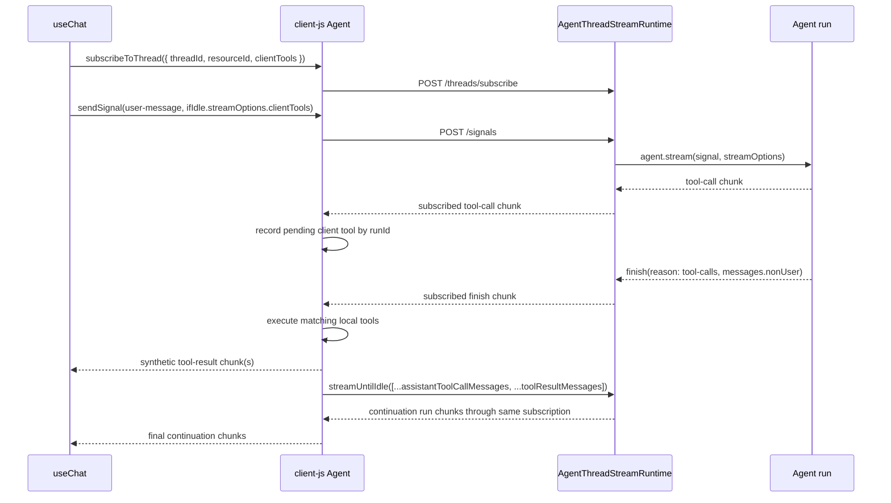

# PR #16540 Summary: Client tools on thread-backed signals

## Overview

This PR fixes the thread-backed `useChat()` signals path so `clientTools` are forwarded and executed when an agent requests local tools. The signals path uses `sendSignal()` to wake/start work and `subscribeToThread()` to receive streamed chunks; client-js now owns the local client-tool loop for subscribed runs.

## Final implementation

- React forwards hook-prop `clientTools` into:
  - `sendSignal().ifIdle.streamOptions.clientTools`
  - `subscribeToThread({ clientTools })`
- client-js keeps `clientTools`, request context, and continuation options local to `subscribeToThread()` instead of posting them to the subscribe route.
- `subscribeToThread()` records matching `tool-call` chunks by `runId`.
- Tool execution waits until the same run emits `finish(reason: 'tool-calls')`, matching the legacy stream flow.
- Synthetic `tool-result` chunks are emitted back through the consumer's normal `onChunk` pipeline.
- Continuation uses `streamUntilIdle()` as the write-side continuation mechanism with non-empty messages:
  - assistant tool-call messages from `finish.payload.messages.nonUser`
  - generated tool-result messages
- The old risky behavior is gone: no eager execution on raw `tool-call` chunks and no `streamUntilIdle([])` continuation.

## Data flow

## Confidence coverage added

### client-js

`client-sdks/client-js/src/resources/agent.test.ts` now covers:

- `tool-call` chunks are recorded but do not execute immediately.
- client tools execute only after `finish(reason: 'tool-calls')`.
- synthetic `tool-result` chunks are emitted after the finish chunk.
- continuation payload contains assistant tool-call messages plus tool-result messages, not `[]`.
- multiple client tool calls in one assistant step.
- unknown/non-client tools are ignored without starting a continuation.
- thrown client-tool errors become error-shaped `tool-result` payloads.
- pending tool calls are scoped by `runId` and do not mix across runs.
- later continuation-run chunks are still consumed through the same subscription pipeline.

### React

`client-sdks/react/src/agent/hooks.test.ts` now covers:

- thread-backed `useChat()` opts into signals and forwards `clientTools` to `subscribeToThread()`.
- streamed thread messages forward `clientTools` into `sendSignal().ifIdle.streamOptions`.
- legacy/no-thread path still forwards `clientTools` to `streamUntilIdle()`.

## Verification run

Passed:

- `pnpm install`
- `pnpm --filter @mastra/client-js exec vitest run src/resources/agent.test.ts --bail 1 --reporter=dot`
- `pnpm --filter @mastra/react exec vitest run src/agent/hooks.test.ts --bail 1 --reporter=dot`
- `pnpm --filter @mastra/client-js exec tsc -p tsconfig.json --noEmit`
- `pnpm --filter @mastra/client-js build:lib`

Known unrelated issue after merging `main`:

- `pnpm --filter @mastra/react exec tsc -p tsconfig.json --noEmit` currently fails in existing React test files unrelated to this PR:
  - `src/lib/ai-sdk/utils/toUIMessage.test.ts` expects `resumeSchema` as `ZodAny`, while current core types expect `string`.
  - `src/mastra-client-context.test.tsx` has React `createElement` typing errors around required `children`.

## Remaining concerns

These are documented follow-ups rather than blockers for this fix:

1. **Per-send continuation options are not wired into an already-open React subscription.**
   `SubscribeAgentThreadParams.continuationOptions` exists and client-js uses it, but React currently opens the subscription from hook props and does not pass per-send model settings/instructions/provider options into that subscription continuation loop.

2. **Request context can be stale for reused subscriptions.**
   React stores the latest request context in a ref for sends, but the client-js subscription closure captures the request context used when `subscribeToThread()` was opened.

## Confidence assessment

Confidence is now high for the corrected client-tool signals behavior covered by this PR: finish-time execution, real continuation payloads, run scoping, error payloads, multi-tool steps, same-subscription continuation chunks, and React client-tool forwarding are all covered by focused tests.
