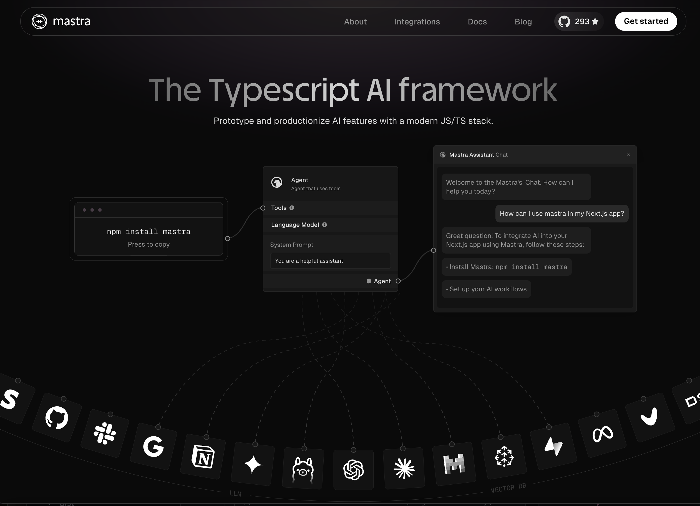

# Mastra

[](https://mastra.ai)

Mastra is an opinionated Typescript framework that helps you build AI applications and features quickly. It gives you the set of primitives you need: workflows, agents, RAG, integrations, syncs and evals. You can run Mastra on your local machine, or deploy to a serverless cloud.

The main Mastra features are:

Features|Description
--------|--------
[LLM Models](https://mastra.ai/docs/guide/how-to/00-llm-models) | Mastra supports a variety of LLM providers, including OpenAI, Anthropic, Google Gemini. You can choose the specific model and provider, choose system and user prompts, and decide whether to stream the response.
[Agents](https://mastra.ai/docs/guide/how-to/01-creating-agents) | Agents are systems where the language model chooses a sequence of actions. In Mastra, agents provide LLM models with tools, workflows, and synced data. Agents can call your own functions or APIs of third-party integrations and access knowledge bases you build.
[Tools](https://mastra.ai/docs/guide/how-to/02-adding-tools) | Tools are typed functions that can be executed by agents or workflows, with built-in integration access and parameter validation. Each tool has a schema that defines its inputs, an executor function that implements its logic, and access to configured integrations.
[Workflows](https://mastra.ai/docs/guide/how-to/03-building-workflows) | Workflows are durable graph-based state machines. They have loops, branching, wait for human input, embed other workflows, do error handling, retries, parsing and so on. They can be built in code or with a visual editor. Each step in a workflow has built-in OpenTelemetry tracing. 
[RAG](https://mastra.ai/docs/guide/how-to/04-knowledge-sources) | Retrieval-augemented generation (RAG) lets you construct a knowledge base for agents. RAG is an ETL pipeline with specific querying techniques, including chunking, embedding, and vector search.
[Integrations & Syncs](https://mastra.ai/docs/guide/how-to/05-adding-integrations) | In Mastra, syncs are async functions that can be deployed as background tasks across different execution environments. Integrations are auto-generated, type-safe API clients for third-party services that can be used as tools for agents or steps in workflows. 
[Evals](https://mastra.ai/docs/guide/how-to/06-running-evals) | Evals are automated tests that evaluate LLM outputs using model-graded, rule-based, and statistical methods. Each eval returns a normalized score between 0-1 that can be logged and compared. Evals can be customized with your own prompts and scoring functions.

## Quick Start

### Prerequisites

- Node.js (v20.0+)

## Get an LLM provider API key

If you don't have an API key for an LLM provider, you can get one from the following services:

- [OpenAI](https://platform.openai.com/)
- [Anthropic](https://console.anthropic.com/settings/keys)
- [Google Gemini](https://ai.google.dev/gemini-api/docs)

If you don't have an account with these providers, you can sign up and get an API key. OpenAI and Anthropic require a credit card to get an API key. Gemini does not and has a generous free tier for its API.

## Create a new project

As a first step, create a project directory and navigate into it:

```bash copy
mkdir hello-mastra
cd hello-mastra
```

Next, initialize a TypeScript project using npm:

```bash copy npm2yarn
npm init -y
npm install typescript tsx @types/node @mastra/core@alpha --save-dev
```

### Add an index.ts file

```bash
mkdir src
touch src/index.ts
```

Then, add this code to `src/index.ts`:

```typescript
import { Agent } from '@mastra/core';

async function main() {
  const agent = new Agent({
    name: 'story-writer',
    maxSteps: 3,
    model: {
      provider: 'OPEN_AI_VERCEL',
      name: 'gpt-4o',
      toolChoice: 'auto'
    },
    instructions: `You are a helpful assistant who writes creative stories.`,
    tools: {},
  });

  const result = await agent.text({
    messages: ["Write a short story about a robot learning to paint."]
  });

  console.log("Agent response:", result.text);
}

main();
```

### Run the script

Finally, run the script:

```bash copy
OPENAI_API_KEY=<your-openai-api-key> npx tsx src/index.ts
```

If you're using Anthropic, set the `ANTHROPIC_API_KEY`. If you're using Gemini, set the `GOOGLE_GENERATIVE_AI_API_KEY`.