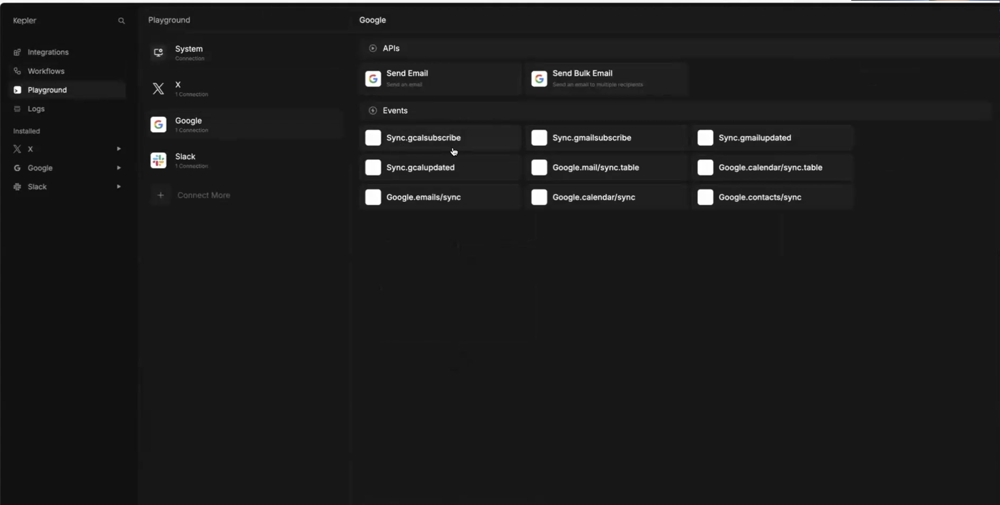

# Calling client APIs

Kepler generates a client library for each third-party service it integrations with. The client library allows you to interact with third-party APIs in a typesafe way, with autocomplete and authentication handled.

Kepler generates client libraries for third-party APIs that have an OpenAPI spec. These include a set of APIs as well as events.

## Using the client library

Here's an example of how to use the client library:

```ts
import { Framework } from '@kpl/core';

import config from './kepler-config';

import { TwilioIntegration } from '.';

const integrationName = 'TWILIO';
const connectionId = 'user@example.com';

const integrationFramework = Framework.init(config);
const integration = integrationFramework.getIntegration(integrationName) as TwilioIntegration;

const client = await integration.getApiClient({ connectionId });
const response = await client['/2010-04-01/Accounts.json'].get();
```

## Browing APIs and Events

The admin console has an integration playground with a way to browse a client library's APIs and events.


