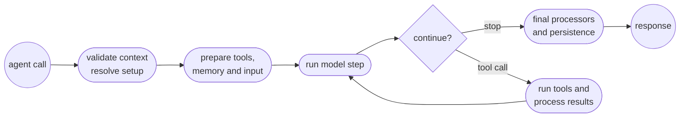

# Agent lifecycle

An agent run starts before the first model call. Initial setup covers request context validation and dynamic configuration. Mastra prepares the input and tools before entering the model loop. Finalization begins after the loop stops.

If validation, dynamic models, instructions, tools, skills, processor factories, or workspace configuration need a value, establish it in server middleware or immediately before calling `agent.generate()` or `agent.stream()`. Don't rely on `processInput` as universal setup middleware: some preparation has already completed, while regular tool preparation can run in parallel with it.

## Lifecycle overview

The diagram shows stable conceptual phases rather than internal workflow steps. Some preparation is concurrent, and durable execution places work across persistence boundaries differently from a regular in-process run.

## Before the loop

`generate()` and `stream()` first validate the supplied `RequestContext` against the agent's `requestContextSchema`. Validation happens before dynamic default options, so a default-options callback can't add a missing required value in time.

Mastra then reuses the caller's `RequestContext` instance throughout the run. Dynamic configuration, processors, and tool execution receive that live instance rather than independent per-callback copies. A mutation can therefore be visible later in the same run, subject to when each consumer resolves.

Preparation doesn't have one strictly linear order:

| Work | Timing | What this means for `RequestContext` |
| - | - | - |
| Validation, workspace, model, and instructions | Before `processInput` | Required values must already exist at the call boundary. |
| Memory-, workspace-, and skills-derived processor instances used for `processInput` | Resolved before `processInput` | Mutating context inside `processInput` can't change how these instances were selected. |
| Dynamic skill resolution | Before `processInput` | Skill selection can't depend on a value first added by `processInput`. |
| Tool conversion in a regular run | In parallel with memory and input preparation | A dynamic `tools` callback has no guaranteed ordering relative to `processInput`. |
| `processInput` | Once during initial input preparation | It can transform messages and establish state for later loop callbacks and tool execution. |
| Effective input, LLM-request, and error processor factories used by the loop | After the regular preparation branches join | These factories can observe earlier context mutations, but this doesn't make `processInput` a safe setup point for every resolver. |
| Durable preparation | Before durable loop execution | The placement differs from the regular path, and resumed work may skip initial input processing. |

This ordering is why caller-side or middleware enrichment is the reliable choice for authorization, tenant scope, feature flags, and other values that must be visible everywhere.

## Choose the `RequestContext` boundary

A context value can only affect work that hasn't happened yet. Set each value at the earliest trusted boundary that needs it.

For example, an application may check a user's access and derive a tenant or account scope. Perform that check outside the agent, store the result in a new `RequestContext`, then pass the context to `generate()` or `stream()`. Dynamic configuration and tools can read the same trusted scope without performing the check again.

The context carries the result of the authorization check. It doesn't replace authorization at the application boundary.

| The value must affect | Establish it | Why |
| - | - | - |
| Validation, model, instructions, skills, workspace, input processors used by `processInput`, or dynamic tools | Before `generate()` or `stream()`, usually in server middleware or caller code | These consumers resolve before or concurrently with `processInput`. |
| Later loop processor factories, processor hooks, or tool execution | Before `generate()` or `stream()` when practical, or in `processInput` | These consumers receive the same live context after input processing. |
| Resumed durable work | At the trusted request or resume boundary | Initial input processors may not run again, and non-serializable values must be reconstructed. |
| Model reasoning | In model-visible instructions or messages | `RequestContext` is runtime data and isn't automatically added to the prompt. |

Create one context per independent request unless you intentionally want to share its values. See [Request context](/docs/server/request-context) for schema and middleware guidance, including reserved identity values.

`processInput` remains useful for message transformation and loop-downstream state. A mutation there can reach later processor hooks and tool execution. It can't change initial validation or completed skill and input-processor resolution, and dynamic tool preparation may already be running.

## Inside each model step

Each model step follows this public callback sequence:

1. `processInputStep` receives the accumulated message list before the next model call.
1. `processLLMRequest` receives the provider-facing prompt after message conversion.
1. The provider streams its response, and `processOutputStream` can inspect or transform each chunk.
1. `processLLMResponse` runs after the provider stream for that step completes.
1. `processOutputStep` runs after the model step, before locally executed tools.
1. If the model requested local or client tools, Mastra processes their input and handles any configured approval. It then executes the tool or waits for its result.
1. `processToolResult` receives each local or client tool result before the raw result is persisted to the message list.

A provider-executed tool can return its result differently. If a deferred provider result arrives during a later model stream, `processToolResult` runs inline when that result arrives rather than at one universal post-step position.

See the [Processor interface](/reference/processors/processor-interface) for callback arguments and return types.

### Callback timing

| Callback or operation | Frequency | Position and visibility |
| - | - | - |
| `processInput` | Once per initial request | During input preparation before the loop. Durable resume may skip it. |
| `processInputStep` | Once per model step | Before the provider request. It sees messages and tool results accumulated so far. |
| `processLLMRequest` | Once per provider call | Last processor stage for rewriting the provider-facing prompt. Its prompt changes aren't written back to the message list. |
| `processOutputStream` | Per streamed chunk | Runs while model output arrives. Data chunks are included when the processor opts in. |
| `processLLMResponse` | Once per completed provider stream | Receives the completed response for the current model step. |
| `processOutputStep` | Once per model step | Runs after the model response and before locally executed tools. |
| Tool `onInputStart` | When streamed tool input begins | Runs before complete tool arguments are available. |
| Tool `onInputDelta` | Per streamed tool-input chunk | Observes incremental tool arguments. |
| Tool `onInputAvailable` | Once when tool input is complete | Runs after arguments are parsed and validated, before execution. |
| Tool execution | Once per local tool call | Receives the live `RequestContext`. Approval or suspension can delay execution. |
| Tool `onOutput` | Once after successful local execution | Receives the tool output. |
| `processToolResult` | Per local/client result, or when a deferred provider result arrives | Can inspect, redact, or abort before a raw tool result is persisted. |
| `processAPIError` | On eligible provider API errors | Can update request state and request another provider attempt. |
| `onIterationComplete` | Once after each completed loop iteration | Observes the iteration result and can influence whether execution continues. |
| `processOutputResult` | Once at finalization | Post-processes the completed agent result before it's returned. |

### Understand what persists

Processor methods don't all modify the same representation:

- `processInput` and `processInputStep` work with the live message list. Their changes can affect later model steps and may be saved by memory processors.
- `processLLMRequest` changes only the prompt sent for that provider call. Use it for transient provider-facing changes that shouldn't alter stored conversation history.
- `processOutputStream` changes streamed chunks. Processor state can carry data across chunks and later output callbacks for the same request.
- `processToolResult` runs before a raw tool result enters the message list, allowing validation or redaction before later model steps or persistence.
- `processOutputResult` can change the final returned messages or metadata during finalization.

## Continue or stop

After a model step and any requested tool work, Mastra decides whether another model step is needed. The loop can continue when tool results need to be sent back to the model or when an iteration hook explicitly requests more work.

Execution stops when a configured condition is met. These conditions can include:

- A final model response that doesn't request another tool.
- A custom `stopWhen` condition evaluated against accumulated steps.
- The `maxSteps` limit.
- Task-completion, goal, or delegation outcomes.
- A terminal provider finish reason, error, processor tripwire, or abort.

These checks cooperate rather than forming a public, exhaustive internal order. Treat `maxSteps` as a bound on model steps and use `stopWhen` for application-specific completion rules.

When the loop stops normally, final output processing runs once, memory and other completion side effects run as configured, and `generate()` resolves or the stream closes with the final result.

## Errors, retries, and aborts

Provider API rejections can reach `processAPIError`. An error processor may adjust the request or messages and request a retry. Error-processor retries have their own default budget. Set `maxProcessorRetries` explicitly when you need a specific limit.

Calling `abort()` from an input or output processor raises a tripwire. Set `retry: true` to let an eligible input-step or output-step check replay the model step with feedback. `maxProcessorRetries` bounds replay attempts. A tripwire without a retry stops normal execution and is exposed in the result or stream.

An external abort signal is passed through provider calls and tool lifecycle work. Aborting stops further loop execution and emits the appropriate stream termination. Mastra preserves the partial result where supported. Errors that aren't recovered by a processor propagate to the caller.

See [Processors](/docs/agents/processors#retry-mechanism) for retry configuration, tripwires, and API error handling.

## Durable suspend and resume

Durable execution crosses serialization boundaries. Mastra snapshots serializable `RequestContext` entries for durable work, so functions, class instances, open connections, and other non-serializable values shouldn't be expected to survive a suspension, process restart, or cross-process transport.

Reconstruct those values from stable identifiers at a trusted request or resume boundary. Initial `processInput` processing may be skipped when a durable run resumes because the conversation state already lives in the durable snapshot. Don't depend on a one-time `processInput` side effect being replayed.

For authorization and tool scoping, repeat the authoritative enrichment step whenever an external request resumes a run, and store only the serializable scope needed by downstream components. See [Durable agents](/docs/harness/durable-agents) for persistence and recovery behavior.

## Related documentation

- [Request context](/docs/server/request-context): Define, validate, and populate runtime context.
- [Processors](/docs/agents/processors): Configure processors, retries, and tripwires.
- [Processor interface](/reference/processors/processor-interface): Review callback arguments and return values.
- [Tools](/docs/agents/tools): Configure tool execution, approval, and lifecycle hooks.
- [Durable agents](/docs/harness/durable-agents): Persist and resume long-running agent execution.
