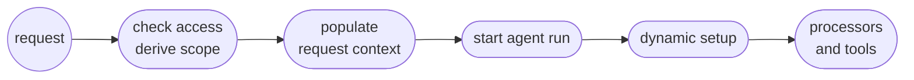

# Agent lifecycle

When you call `generate()` or `stream()`, Mastra starts an agent run. It prepares the agent and its input before calling the model. If the model requests a tool, Mastra runs it and may call the model again. When the work is complete, Mastra finalizes and returns the result.

This guide breaks that work into preparation, loop execution, and finalization. It explains where [processors](/docs/agents/processors) run, what can cause another model call, and how regular and durable runs differ.

## Runs, iterations, and model steps

Work happens at three levels:

- **Run**: One call to `generate()` or `stream()` and the work it starts. A run ends with a result or error, or it can suspend and resume when durable execution waits for external input.
- **Loop iteration**: One pass through the agent loop. It starts with a model step. Requested tool work follows before Mastra decides whether to continue.
- **Model step**: One request to the model provider and the response it produces. Input and output processors run around this request.

A run contains one or more loop iterations. It stops after the current iteration when the model returns a final answer, or processes the requested tool result and begins another iteration when the model requests a tool. An iteration commonly coincides with one model step, but treat that pairing as implementation behavior rather than a stable contract.

## Lifecycle overview

The diagram shows the public mental model, not internal workflow steps. Validation and dynamic setup are part of preparation, and tool preparation can overlap input and memory preparation. A regular run keeps working in the current process. A durable run can save its state and restore it later.

## Preparation

Preparation turns the agent definition and the current request into a runnable model interaction. During this phase, Mastra:

- Validates the supplied [`RequestContext`](/docs/server/request-context).
- Resolves the model, instructions, workspace, skills, and other dynamic configuration.
- Builds the message list from the current input and configured memory.
- Prepares tools and the processors used during the loop.

By the end of preparation, the run has the messages, tools, and processor configuration needed for its first model step, although these tasks don't all happen in one strict sequence.

| Preparation work | Timing | What this means for `RequestContext` |
| - | - | - |
| Validation, workspace, model, and instructions | Before `processInput` | Required values must already exist when the run starts. |
| Memory-, workspace-, and skills-derived processor instances used for `processInput` | Resolved before `processInput` | A context change inside `processInput` can't change how these instances were selected. |
| Dynamic skill resolution | Before `processInput` | Skill selection can't depend on a value first added by `processInput`. |
| Tool conversion in a regular run | In parallel with memory and input preparation | A dynamic `tools` callback has no guaranteed ordering relative to `processInput`. |
| `processInput` | Once during initial input preparation | It can transform messages and establish state for later loop callbacks and tool execution. |
| Effective input, LLM-request, and error processor factories used by the loop | After the regular preparation branches join | These factories can observe earlier context changes, but `processInput` isn't a safe setup point for every resolver. |
| Durable preparation | Before durable loop execution | Its placement differs from the regular path, and resumed work may skip initial input processing. |

`generate()` and `stream()` validate `RequestContext` before resolving dynamic default options. A default-options callback therefore can't add a missing required value in time for validation.

In a regular run, Mastra reuses the caller's `RequestContext` instance throughout execution. Dynamic configuration, processors, and tool execution receive that live instance rather than separate copies. Whether a change is visible depends on whether the consumer has already resolved.

## Choose the `RequestContext` boundary

A context value can only affect work that hasn't happened yet. Set each value at the earliest trusted boundary that needs it.

For example, an application may check a user's access and derive a tenant or account scope. Perform that check outside the agent, store the result in a new `RequestContext`, then pass the context to `generate()` or `stream()`. Dynamic configuration and tools can read the same trusted scope without performing the check again.

The context carries the result of the authorization check. It doesn't replace authorization at the application boundary.

| The value must affect | Establish it | Why |
| - | - | - |
| Validation, model, instructions, skills, workspace, input processors used by `processInput`, or dynamic tools | Before `generate()` or `stream()`, usually in server middleware or caller code | These consumers resolve before or concurrently with `processInput`. |
| Later loop processor factories, processor hooks, or tool execution | Before `generate()` or `stream()` when practical, or in `processInput` | These consumers receive the same live context after input processing. |
| Resumed durable work | At the trusted request or resume boundary | Initial input processors may not run again, and non-serializable values must be reconstructed. |
| Model reasoning | In model-visible instructions or messages | `RequestContext` is runtime data and isn't automatically added to the prompt. |

Create one context per independent request unless you intentionally want to share its values. The [Request context guide](/docs/server/request-context) explains schemas and server middleware.

`processInput` remains useful for message transformation and state needed later in the loop. A change there can reach later processor hooks and tool execution. It can't change initial validation or completed skill and input-processor resolution, and dynamic tool preparation may already be running.

## The agent loop

The loop works with the messages accumulated so far. Each iteration gives those messages to the model. A final answer can end the loop. When the model requests a tool, Mastra runs it and adds the result to the conversation. The result can lead to another model step.

### Around each model step

Processor callbacks run in this public sequence:

1. `processInputStep` receives the accumulated message list before the next model call.
1. `processLLMRequest` receives the provider-facing prompt after message conversion.
1. The provider streams its response, and `processOutputStream` can inspect or transform each chunk.
1. `processLLMResponse` runs after the provider stream for that step completes.
1. `processOutputStep` runs after the model step, before locally executed tools.
1. If the model requested local or client tools, Mastra processes their input and handles any configured approval. It then executes the tool or waits for its result.
1. `processToolResult` receives each local or client tool result before the raw result enters the message list.

Provider-executed tools can return results differently. If a deferred provider result arrives during a later model stream, `processToolResult` runs when that result arrives. It doesn't have one universal position after every model step.

The [Processor interface](/reference/processors/processor-interface) documents callback arguments and return types.

### Callback timing

| Callback or operation | Frequency | Position and visibility |
| - | - | - |
| `processInput` | Once per initial request | During input preparation before the loop. Resuming from a durable snapshot may skip it. |
| `processInputStep` | Once per model step | Before the provider request. It sees messages and tool results accumulated so far. |
| `processLLMRequest` | Once per provider call | Last processor stage for rewriting the provider-facing prompt. Its prompt changes aren't written back to the message list. |
| `processOutputStream` | Per streamed chunk | Runs while model output arrives. Data chunks are included when the processor opts in. |
| `processLLMResponse` | Once per completed provider stream | Receives the completed response for the current model step. |
| `processOutputStep` | Once per model step | Runs after the model response and before locally executed tools. |
| Tool `onInputStart` | When streamed tool input begins | Runs before complete tool arguments are available. |
| Tool `onInputDelta` | Per streamed tool-input chunk | Observes incremental tool arguments. |
| Tool `onInputAvailable` | Once when tool input is complete | Runs after arguments are parsed and validated, before execution. |
| Tool execution | Once per local tool call | Receives the live `RequestContext`. Approval or suspension can delay execution. |
| Tool `onOutput` | Once after successful local execution | Receives the tool output. |
| `processToolResult` | Per local/client result, or when a deferred provider result arrives | Can inspect, redact, or abort before a raw tool result enters the message list. |
| `processAPIError` | On eligible provider API errors | Can update request state and request another provider attempt. |
| `onIterationComplete` | Once after each completed loop iteration | Observes the iteration result and can influence whether execution continues. |
| `processOutputResult` | Once at finalization | Post-processes the completed agent result before it's returned. |

### What changes persist

Processor methods don't all modify the same representation:

- `processInput` and `processInputStep` work with the live message list. Their changes can affect later model steps and may be saved by memory processors.
- `processLLMRequest` changes only the prompt sent for that provider call. Use it for temporary provider-facing changes that shouldn't alter stored conversation history.
- `processOutputStream` changes streamed chunks. Processor state can carry data across chunks and later output callbacks for the same request.
- `processToolResult` runs before a raw tool result enters the message list, allowing validation or redaction before later model steps or persistence.
- `processOutputResult` can change the final returned messages or metadata during finalization.

## How the loop decides to continue

After the model step and any requested tool work, Mastra decides whether the run needs another iteration. Tool results often cause another model call because the model must use those results to produce its next response.

The loop stops when a configured or terminal condition is reached. These conditions can include:

- A final model response that doesn't request another tool.
- A custom `stopWhen` condition evaluated against accumulated steps.
- The `maxSteps` limit.
- Task-completion, goal, or [subagent](/docs/subagents) delegation outcomes.
- A terminal provider finish reason, error, processor tripwire, or abort.

These checks work together rather than forming a public, exhaustive internal order. Treat `maxSteps` as a bound on model steps and use `stopWhen` for application-specific completion rules.

## Finalization

A stop moves the run into finalization. `processOutputResult` runs once per request on the final assistant message, whether the run completes normally or the provider throws. Configured output processors run first, then auto-attached memory output processors run after them so message history can persist the final form. Observational Memory manages its own persistence during its `processOutputStep` instead. When finalization completes, `generate()` resolves or the stream closes.

Finalization is separate from a model step. It operates on the result of the whole run rather than the response from one provider call.

## Errors, retries, and aborts

A provider API rejection can reach `processAPIError`. An error processor may change the request or messages and request another provider attempt. `processAPIError` retries and tripwire retries share the same `maxProcessorRetries` bound on the request. When error processors are configured and `maxProcessorRetries` is omitted, Mastra applies a default budget. Set `maxProcessorRetries` explicitly when you need a specific limit.

Calling `abort()` from an input or output processor raises a tripwire. Set `retry: true` to let an eligible input-step or output-step check replay the model step with feedback. `maxProcessorRetries` bounds replay attempts. A tripwire without a retry stops normal execution and is included in the result or stream.

An external abort signal passes through provider calls and tool lifecycle work. When triggered, it stops further loop execution and terminates the stream while preserving the partial result where supported. Errors that no processor recovers propagate to the caller.

See [Processors](/docs/agents/processors#retry-mechanism) for retry configuration, tripwires, and API error handling.

## Regular and durable runs

A regular `Agent` run keeps the loop in the current process. If that process ends, the in-memory execution ends with it.

A [durable agent](/docs/harness/durable-agents) wraps the same agent loop in a workflow. It persists run state and publishes events through PubSub so supported runtimes can recover work and clients can reconnect. Persistent production backends are required when that state and event history must survive process restarts.

Durable execution also lets a run suspend, such as while a tool waits for approval, and resume later from stored state across serialization boundaries that don't exist in a regular in-process run.

Mastra snapshots serializable `RequestContext` entries for durable work. Functions, class instances, open connections, and similar non-serializable values shouldn't be expected to survive either suspension or transport into another process. Reconstruct them from stable identifiers at a trusted request or resume boundary.

Resuming from a stored snapshot can skip initial `processInput` processing, while signal and schedule wakes run it again.

- Repeat the authoritative enrichment step whenever an external request resumes a run.
- Store only the serializable scope you need downstream.
- Don't rely on a one-time `processInput` side effect.

## What to read next

- [Request context](/docs/server/request-context): Define, validate, and populate runtime context.
- [Authentication and identity](/docs/guides/authentication-identity): Keep trusted identity and authorization data outside model-controlled input.
- [Processors](/docs/agents/processors): Configure processors, retries, and tripwires.
- [Processor interface](/reference/processors/processor-interface): Review callback arguments and return values.
- [Tools](/docs/agents/tools): Configure tool execution, approval, and lifecycle hooks.
- [Durable agents](/docs/harness/durable-agents): Persist and resume long-running agent execution.
