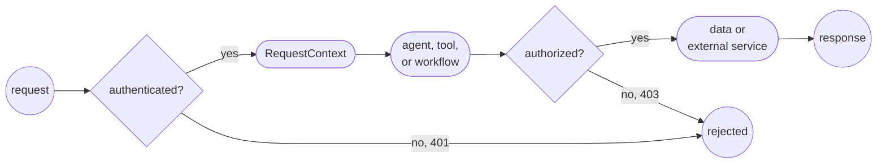

# Authentication and identity propagation

Production authentication is a chain of trust. Mastra first verifies the caller at the server boundary, then carries that identity through runtime code. Each component can act without treating model-controlled input or request data as identity.

Authentication is only the first step. A production application also needs a stable resource boundary, authorization checks where protected data is accessed, and a safe way to select credentials for downstream services.

| Stage | Question | Mastra mechanism |
| - | - | - |
| Authentication | Who is calling? | [`server.auth`](/docs/auth/overview) |
| Identity propagation | How does verified identity reach runtime code? | [`RequestContext`](/docs/server/request-context) |
| Authorization | What can this caller access or execute? | Application checks, RBAC, or [FGA](/docs/auth/fga) |
| Outbound authentication | Which credential should Mastra use with another service? | Trusted tool code or MCP connection configuration |

## Design the identity flow

Keep identity decisions on the trusted side of the application. The caller can supply a credential, but only the auth provider decides which user it represents. Agents, tools, and workflows receive the resulting server-owned context.



This flow establishes four boundaries:

- Headers, cookies, and request bodies are untrusted until authentication succeeds.
- Reserved identity values in `RequestContext` are owned by the server.
- Tool input is model-controlled and must not select the caller, tenant, or owner.
- External credentials stay in trusted runtime code and shouldn't become model input or tool output.

## Establish trusted identity

Configure `server.auth` with an [auth provider](/docs/auth/overview) or an `authenticateToken` function. When auth is configured, built-in and custom routes require a valid user unless a route explicitly opts out.

Choose a stable identity from the verifier and map it to the boundary used by memory, threads, and application data.

```typescript title="src/mastra/index.ts"
import { Mastra } from '@mastra/core'

import { verifyAccessToken } from './lib/auth'

type AuthUser = {
  id: string
  workspaceId: string
}

export const mastra = new Mastra({
  server: {
    auth: {
      authenticateToken: async token => verifyAccessToken(token),
      mapUserToResourceId: (user: AuthUser) => `${user.workspaceId}:${user.id}`,
    },
  },
})
```

Use a canonical identifier from the verified provider. Display names and other mutable profile fields aren't suitable ownership keys. Include organization, workspace, or identity-provider scope when a user ID isn't globally unique.

If a [custom API route](/docs/server/custom-api-routes#authentication) must be public, set `requiresAuth: false`. Public webhooks still need to verify the provider signature before trusting any identity or event data in the body.

:::warning

Mastra routes are public when `server.auth` isn't configured. A production deployment must configure authentication for every server surface that shouldn't be anonymous. If you set a custom `server.apiPrefix`, update the auth path configuration to use that prefix.

:::

## Choose the resource boundary

`mapUserToResourceId` turns the authenticated user into the server-owned `MASTRA_RESOURCE_ID_KEY`. Mastra uses this value to scope memory and threads and to prevent a client-provided resource ID from replacing the trusted one.

Choose the narrowest boundary that should share state:

| Desired boundary | Example mapping |
| - | - |
| Private memory for each user | `user.id` |
| Shared memory for an organization | `user.organizationId` |
| User memory within a workspace and project | `${workspaceId}:${projectId}:${userId}` |

Authentication identifies a caller, but it doesn't automatically authorize every custom database row, API object, or business resource. `mapUserToResourceId` protects Mastra memory and thread ownership. Application tools and routes must still apply their own ownership checks, RBAC, or FGA where data is accessed.

## Enforce identity at the data boundary

Authorization belongs in trusted code, as close as possible to the protected operation. Don't rely on an agent instruction such as “only return the caller's records” as the security boundary.

A tool should derive ownership from `RequestContext`, not from model-generated input:

```typescript title="src/mastra/tools/list-orders.ts"
import { MASTRA_RESOURCE_ID_KEY } from '@mastra/core/request-context'
import { createTool } from '@mastra/core/tools'
import { z } from 'zod'

import { orders } from '../lib/orders'

export const listOrders = createTool({
  id: 'list-orders',
  description: 'List orders owned by the authenticated resource',
  inputSchema: z.object({ status: z.enum(['open', 'shipped']).optional() }),
  execute: async ({ status }, { requestContext }) => {
    const resourceId = requestContext.getRaw(MASTRA_RESOURCE_ID_KEY)

    if (typeof resourceId !== 'string') {
      throw new Error('Authenticated resource ID is missing')
    }

    return orders.list({ ownerId: resourceId, status })
  },
})
```

The model can choose `status`. It can't choose `ownerId`.

Use the same rule for custom routes and workflow steps: derive ownership from authenticated context, then constrain the database query or service call before returning data.

## Carry identity through runtime code

Auth middleware writes the authenticated user, token, and resource boundary to `RequestContext` before handlers run. Mastra then passes the same context to:

- Dynamic agent options such as `instructions`, `model`, `tools`, and `memory`
- Tool `execute` callbacks
- Workflow step `execute` callbacks
- Middleware and custom API route handlers

Use application keys with `requestContext.get()`. Use `getRaw()` for reserved runtime keys such as `MASTRA_RESOURCE_ID_KEY` and `MASTRA_AUTH_TOKEN_KEY`. The [RequestContext guide](/docs/server/request-context) documents the available component APIs and middleware patterns.

`RequestContext` isn't ambient global state. Pass it explicitly when starting an agent or workflow outside the Mastra server request path.

:::tip

Identity can personalize instructions and select available tools, but those choices aren't authorization checks. Enforce access in the component or FGA policy that touches the protected resource.

:::

## Select outbound credentials from trusted identity

An incoming auth token and a downstream service credential solve different problems:

- **Token forwarding:** The external service trusts the same bearer token presented to Mastra.
- **Credential selection:** The authenticated user or resource ID selects a separate tenant credential stored by the application.

Use token forwarding only when the receiving service is intended to trust that token. For multi-tenant services, resolve a tenant-scoped credential in trusted tool code instead:

```typescript title="src/mastra/tools/list-invoices.ts"
import { MASTRA_RESOURCE_ID_KEY } from '@mastra/core/request-context'
import { createTool } from '@mastra/core/tools'
import { z } from 'zod'

import { billing, tenantCredentials } from '../lib/billing'

export const listInvoices = createTool({
  id: 'list-invoices',
  description: 'List invoices for the authenticated tenant',
  inputSchema: z.object({ limit: z.number().int().min(1).max(100).default(20) }),
  execute: async ({ limit }, { requestContext }) => {
    const resourceId = requestContext.getRaw(MASTRA_RESOURCE_ID_KEY)

    if (typeof resourceId !== 'string') {
      throw new Error('Authenticated resource ID is missing')
    }

    const credential = await tenantCredentials.getBillingToken(resourceId)
    return billing.listInvoices({ limit, token: credential.token })
  },
})
```

The credential provider should fail closed for unknown resources and return least-privilege credentials. Keep secrets out of its errors. The model supplies only business input such as `limit`. Trusted code selects the tenant and credential.

The same pattern applies to an external MCP server. Build its authorization headers from a server-owned resource ID or `MASTRA_AUTH_TOKEN_KEY`, then expose only the resulting tools to the agent. See [MCP connections](/docs/connections/mcp) for client configuration.

## Forward identity to MCP tools

When an `MCPServer` runs behind a Mastra server protected by `server.auth`, Mastra bridges the authenticated caller into the MCP SDK `authInfo`. Tools exposed through that server can use the caller identity without parsing the original request again:

```typescript title="src/mastra/tools/get-customer-record.ts"
import { createTool } from '@mastra/core/tools'
import { z } from 'zod'

import { customers } from '../lib/customers'

export const getCustomerRecord = createTool({
  id: 'get-customer-record',
  description: 'Get the authenticated customer record',
  inputSchema: z.object({}),
  execute: async (_input, { mcp }) => {
    const user = mcp?.extra.authInfo?.extra?.user as { id?: string } | undefined

    if (!user?.id) throw new Error('Authenticated MCP caller is missing')
    return customers.getByUserId(user.id)
  },
})
```

`MCPServer.mapAuthInfoToUser` performs the reverse mapping when MCP transport identity must become the user consumed by [fine-grained authorization](/docs/auth/fga). Keep the mapping at the transport boundary instead of accepting a user ID as a tool argument.

## Keep secrets outside the model boundary

`RequestContext` and tool execution run in trusted application code. The model doesn't automatically receive their contents.

| Information | Trusted runtime code | Model |
| - | - | - |
| Authenticated user in `RequestContext` | Available | Only when application code adds it to instructions or results |
| Raw token in `MASTRA_AUTH_TOKEN_KEY` | Available | Shouldn't be included in prompts or tool results |
| Tenant API keys and service credentials | Available to the code that resolves them | Shouldn't be exposed |
| Tool arguments | Must be treated as untrusted input | Usually selected by the model |
| Tool results | Available | Usually returned to the model |

Return the minimum data the model needs. Don't return authorization headers, access tokens, credential-provider records, or unfiltered upstream responses that may contain secrets.

`RequestContext.serializeForSpan()` redacts `MASTRA_AUTH_TOKEN_KEY` when context is attached to tracing spans. Application logs and custom telemetry must apply the same principle to other credentials and sensitive identity fields.

## Add authorization after authentication

Use the authorization layer that matches the resource:

| Requirement | Use |
| - | - |
| Broad capabilities for roles such as admin, member, and viewer | `server.rbac` |
| Permissions that depend on a user-resource relationship | `server.fga` |
| Ownership of application database rows | A scoped query or application authorization check |

A missing or invalid identity should produce `401`. A known identity without permission should produce `403`. The [FGA guide](/docs/auth/fga) owns the detailed resource mappings, permission mappings, and route enforcement configuration.

## Verify before production

Test the complete trust chain, not only the successful request:

- [ ] A request without credentials receives `401` from every protected server surface.
- [ ] Invalid credentials don't populate a user or resource ID in `RequestContext`.
- [ ] A public webhook verifies its provider signature before trusting the body.
- [ ] One user can't read, continue, or create a thread under another user's resource ID.
- [ ] Tool input can't override the authenticated user, tenant, resource ID, or ownership filter.
- [ ] A known user without permission receives `403` from the enforcing layer.
- [ ] Downstream credentials are selected from trusted identity, not a prompt or tool argument.
- [ ] Raw tokens and service credentials don't appear in prompts, tool results, logs, traces, or errors.
- [ ] Direct agent and workflow tests pass an explicit `RequestContext` with the expected trusted keys.

For manual testing in Studio, use [request context presets](/docs/server/request-context#studio). Use production authentication outside local development.
