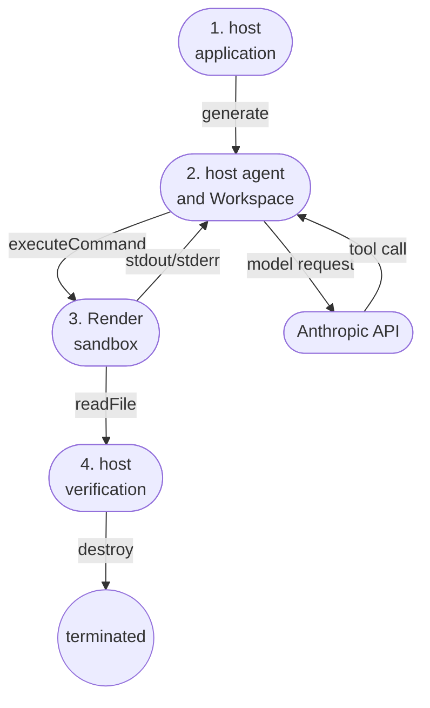

# Render

When your agent needs to run generated code or test a project, give it a separate execution environment through a <a href="/docs/sandbox/overview" target="_blank" rel="noopener noreferrer">Workspace</a>. `RenderSandbox` runs those commands in <a href="https://render.com/docs/sandboxes" target="_blank" rel="noopener noreferrer">Render Sandboxes</a> and returns their output to the agent.

:::note[Local integration candidate]

This provider and its catalog placement are prepared for review. The `@mastra/render` package is unpublished and prepared for Mastra's workspace and release process. The instructions below run from the local Mastra checkout containing `workspaces/render`. They don't assume an available npm release. Render Sandboxes requires early access.

:::

## How it works

The TypeScript application and Mastra agent run on your host, which can be your computer or an application server. The host calls Anthropic for model responses. Tool calls execute through Mastra's generated shell tool and `RenderSandbox`, which uses Render's public SDK. Command output returns to the agent and can be sent to the model. The host verifies and downloads the result before terminating the sandbox.



## Prerequisites

Use Node.js 22.13 or newer, npm, the pnpm version pinned by the Mastra checkout, and a Render workspace with <a href="https://render.com/docs/sandboxes" target="_blank" rel="noopener noreferrer">Sandboxes access</a>. The example uses a real Anthropic model from the host. This is a TypeScript integration. The code the agent repairs is JavaScript.

| Environment variable | Purpose |
| - | - |
| `RENDER_API_KEY` | A <a href="https://dashboard.render.com/u/settings#api-keys" target="_blank" rel="noopener noreferrer">Render API key</a> with access to the sandbox workspace. |
| `RENDER_WORKSPACE_ID` | The `tea-...` workspace ID from the <a href="https://dashboard.render.com" target="_blank" rel="noopener noreferrer">Render Dashboard</a>. It determines where the sandbox is created. |
| `ANTHROPIC_API_KEY` | A funded model key from <a href="https://console.anthropic.com/settings/keys" target="_blank" rel="noopener noreferrer">Anthropic Console</a>. |
| `MODEL` (optional) | Mastra model ID. The repair example defaults to `anthropic/claude-haiku-4-5-20251001`. `__GATEWAY_ANTHROPIC_MODEL_SONNET__` also passed live testing. |

Supply these values through your existing secret manager or shell environment before running the example. A `.env` file isn't loaded automatically. Keep credentials in the host environment. `create.env` sends only values you explicitly provide into the sandbox. Don't put the Render or model key there.

## Run a code-repair task

The example gives the agent a CSV program that omits the last amount from its sum. The agent repairs it, runs tests and writes `outputs/report.json`. The expected result is `{"total":42,"row_count":3}`.

From the Mastra repository root, install and build the integration with its workspace dependencies:

```bash
pnpm install --frozen-lockfile
pnpm turbo build --filter @mastra/render
pnpm --filter @mastra/render example
```

A successful run prints the following lines (abbreviated from the live test; the sandbox ID varies):

```text
Sandbox sbx-...: running
Verified report: total=42, row_count=3; 4 original tests passed
Sandbox sbx-...: termination confirmed
```

`running` means the environment is ready. The verification line means the agent completed the repair and the host checked it. The last line confirms Render reports the owned resource as terminated.

The host restores the original input and tests before independently checking all four tests. It downloads the report and corrected source, then confirms sandbox termination. The sandbox denies outbound network access. Model requests originate from the host, so the agent can still call Anthropic.

The full source is `workspaces/render/examples/code-repair/index.ts`. Downloaded files and the validation record appear in `workspaces/render/validation/latest-artifacts/`. If execution fails, the example still attempts cleanup and records the sandbox ID for a retry. Evidence includes the model response and command output. Use `EVIDENCE_DIR` to retain each run in a separate directory.

Live testing passed with Claude Haiku 4.5 and Sonnet 4.6 on released core 1.75.0 and unmodified official main `918704fd4608` (1.76.0-alpha.5). Each run passed all four host-restored tests and confirmed termination. The same versions pass 71 regression tests, build and typechecking. Core 1.67.0 has packed-package import and type checks. Full records are in `workspaces/render/validation/RESULTS.md`.

## Add a Workspace to your agent

From `workspaces/render`, build and pack the unpublished package:

```bash npm2yarn
pnpm build
pnpm pack
```

The output is `mastra-render-0.0.0.tgz`. From your application directory, install it with the tested released core. Replace `/absolute/path/to/mastra` with your local checkout path:

```bash npm2yarn
npm install @mastra/core@1.75.0 /absolute/path/to/mastra/workspaces/render/mastra-render-0.0.0.tgz
npm install --save-dev tsx
```

Use an ESM application (`"type": "module"` in `package.json`). Save the following as `src/run-task.ts`, with the same host credentials configured:

```typescript title="src/run-task.ts"
import { Agent } from '@mastra/core/agent'
import { Workspace } from '@mastra/core/workspace'
import { RenderSandbox } from '@mastra/render'

const sandbox = new RenderSandbox({
  workingDirectory: '/workspace',
  create: {
    timeoutSeconds: 900,
    networkPolicy: { default: 'deny-all' },
  },
})
const workspace = new Workspace({ sandbox })

try {
  await workspace.init()
  await sandbox.writeFiles([{ path: '/workspace/hello.mjs', content: 'console.log(6 * 7)\n' }])
  const agent = new Agent({
    id: 'code-runner',
    name: 'Code runner',
    model: '__GATEWAY_ANTHROPIC_MODEL_SONNET__',
    instructions: 'Use the workspace shell tool to run and verify code.',
    workspace,
  })
  const result = await agent.generate('Run node hello.mjs and report its output.')
  console.log(result.text)
} finally {
  await workspace.destroy()
}
```

Run the application:

```bash npm2yarn
npx tsx src/run-task.ts
```

The agent should report `42`. This minimal example demonstrates registration and command execution. Use the repair example for protected tests and independent cleanup confirmation.

`writeFiles` uploads bytes through the public Render SDK and creates parent directories with a shell command. `workingDirectory` must exist before command execution. Use one Workspace per independent task; a static workspace is otherwise shared across agent requests.

## Files and process state

The shell tool can read, write, list and test files. `sandbox.readFile('/workspace/result.json')` downloads a selected artifact as a Buffer. This provider doesn't implement `WorkspaceFilesystem`, so it doesn't add native Workspace filesystem tools or mounts.

Files persist between exec calls until the sandbox terminates. Each command starts a fresh bash process: `cd`, shell exports and process-local state don't carry into the next call. Set `workingDirectory`, per-command `cwd`, or explicit `env` values when needed. The adapter quotes argv and cwd because SDK 1.2.0 accepts a command string.

Nonzero exit codes are returned with stdout and stderr. Stream and API failures throw an error with the original cause and retained output. Commands are never retried automatically.

## Outbound network access

The default policy blocks outbound traffic. To allow specific destinations, pass current HTTPS rules when creating the provider:

```typescript
const sandbox = new RenderSandbox({
  create: {
    networkPolicy: {
      type: 'allow-list',
      rules: [{ domain: 'example.com', protocol: 'https' }],
    },
  },
})
```

The adapter maps this policy to Render's current API through the public SDK client. It also translates SDK 1.2.0's legacy `allowedDomains` list into HTTPS rules. HTTP stays blocked, even for an allowed domain, and exact domains don't include subdomains. The adapter never falls back to allow-all. Direct `sdk.create()` bypasses the mapping. SDK 1.2.0's unmodified legacy allow-list request is rejected by the live API.

## Transfers and snapshots

Use `upload(path, data)` for bytes or a Node Readable stream. `uploadFile(localPath, remotePath)` streams a host file. `uploadDirectory(localPath, remoteDirectory)` streams a tar archive. The directory helper requires a host `tar` executable. `upload` accepts `contentType: 'application/x-tar'` or `'application/gzip'` to extract archives into the remote directory.

`download(path)` returns bytes, size and content type. `downloadToFile(remotePath, localPath)` atomically replaces a local file after downloading it. The destination parent directory must exist. The SDK buffers downloads in memory. File transfers have no fixed adapter ceiling by default. Configure `maxFileBytes` for an application limit. Uploads can leave partial files after failure.

Run this snapshot example while `sandbox` is active, inside the agent example's `try` block before `workspace.destroy()`:

```typescript
const saved = await sandbox.captureSnapshot({ kind: 'filesystem', name: 'prepared-project' })
const restored = sandbox.restore(saved)
try {
  await restored.start()
  console.log(await restored.executeCommand('ls /workspace'))
} finally {
  try {
    await restored.destroy()
  } finally {
    await sandbox.snapshots.delete({
      sandboxGroupId: saved.sandboxGroupId,
      snapshotId: saved.id,
    })
  }
}
```

Use `kind: 'runtime'` to include memory and CPU state. Runtime restoration preserves the source plan. `snapshots.create/get/list/delete` expose the full SDK snapshot API, including expiry and pagination. Capture doesn't stop the source sandbox.

:::caution[Snapshots need separate cleanup]

Snapshots persist after `destroy()`. Delete them or set `expiresAt`. The snippet attempts snapshot deletion even if restored-sandbox cleanup fails. Retain both resource IDs for retries.

:::

Mastra's `snapshot()` hook creates a named filesystem checkpoint. `clone({ checkpointName, seedCheckpointName })` restores an available checkpoint, falls back to the seed, then to the base configuration. `refresh()`, `listSandboxes()` and `listGroups()` expose metadata and resource queries. `sdk` gives direct access to the same public client and bypasses provider lifecycle tracking. Prefer provider methods when they cover the operation.

## Cleanup, timeouts and attachment

An owned sandbox has a 900-second lifetime by default. Commands have a 60-second deadline and readiness has a 120-second deadline. Returned stdout and stderr retain a 1 MiB tail each and report truncation. Streaming callbacks receive full chunks. Independent commands and transfers may run concurrently. Coordinate writes to shared paths.

Default command cancellation stops and verifies that command's process group while preserving the sandbox and unrelated work. The supervisor uses Linux, Python 3, bash and `/proc`, verified in Render's base image. Modified snapshots must retain those tools. Deliberately detached descendants are outside this process-group guarantee.

Choose `cancellationMode: 'terminate'` for a dedicated owned sandbox when cancellation must dispose of the whole environment. In this mode, infrastructure failures, aborts and timeouts terminate an owned sandbox. For attachments, it stops observation and rejects explicit command timeouts. Use the default command mode to stop only the attached command. Choose `'observe'` to stop waiting without terminating remote work. The native `exec()` event iterator always uses observation-only cancellation. No command is automatically retried after a connection failure.

:::caution[Termination removes sandbox state]

Both `stop()` and `destroy()` terminate an owned sandbox. They don't pause it. Capture a snapshot or download wanted outputs first.

:::

Pass `sandboxId` to attach without taking ownership. Attached command cancellation works with the default mode, and `destroy()` detaches without terminating the resource. `terminate()` explicitly terminates either an owned or attached resource.

If process termination can't be confirmed, the adapter throws and sets `details.remoteMayBeRunning`. <a href="https://github.com/mastra-ai/mastra/issues/26580" target="_blank" rel="noopener noreferrer">Mastra issue #26580</a> tracks a separate core 1.75.0 and tested-main bug that can incorrectly prepend a “killed” statement to an aborted tool error. Confirmed command cancellation works. Uncertain outcomes still need that generic core reporting fix.

A create request can succeed after the caller stops waiting. The provider retains a late ID and attempts cleanup. Retry failed cleanup using that ID. Don't automatically repeat an uncertain create. Snapshot creation receipts, including late responses, are retained in `snapshots.createdSnapshots`. The example verifies sandbox termination through the public list API.

Creation options pass through to the SDK with the networking mapping described above. During current early access, Render uses Oregon and a fixed compute size regardless of `region` or `plan`. See the <a href="https://render.com/docs/sandboxes-sdk-typescript#sandbox-lifecycle" target="_blank" rel="noopener noreferrer">SDK creation reference</a> for service constraints.

The current SDK doesn't expose native pause/resume, individual-command kill, interactive stdin, mounts or preview URL methods. The adapter implements command termination through public exec and leaves interactive background process management and code-mode transport unsupported.

## Render Workflows

Render Sandboxes provides the agent's execution environment. Render Workflows orchestrates durable tasks. This sandbox package needs no workflow service and imports no Workflows integration code. The existing Workflows integration remains a separate, provisional package. Both use Render SDK 1.2.0 and its host credential configuration.

See the <a href="/reference/workspace/sandbox" target="_blank" rel="noopener noreferrer">Workspace sandbox interface</a> for Mastra's extension contract and the <a href="https://render.com/docs/sandboxes-sdk-typescript" target="_blank" rel="noopener noreferrer">Render TypeScript sandbox API</a> for public operations.
