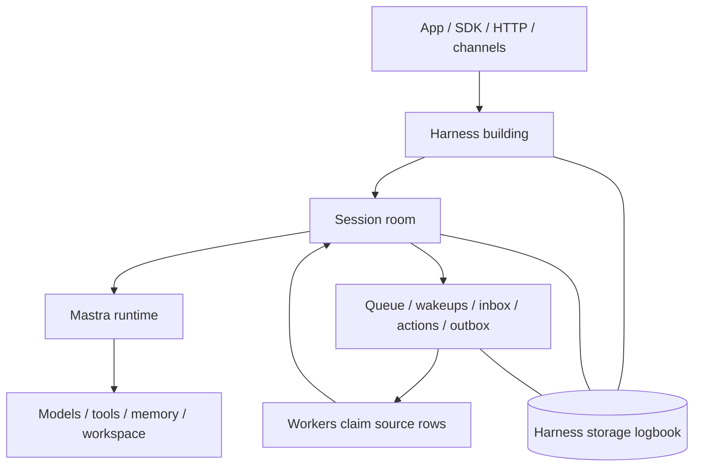
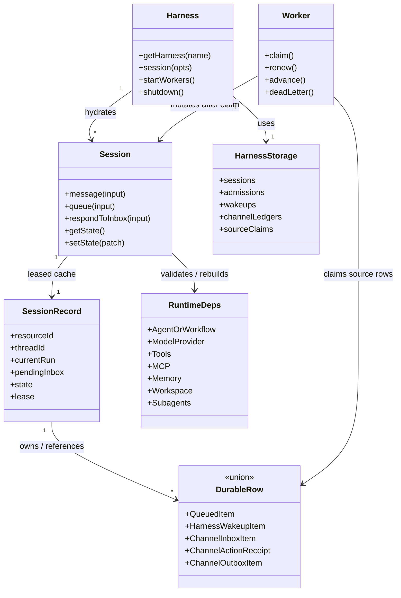

# Harness V1 Implementation Readiness

This file maps the checked Harness v1 spec to the current Mastra codebase. It is
an implementation-planning artifact, not a claim that the current packages have
already changed. The split files under `sections/` remain the spec source of
truth, with tracked claims and outcomes recorded through `issues/`.

Read this file as a gap map onto existing Mastra primitives, not permission to
invent parallel infrastructure. Harness v1 extends the current storage-domain,
request-context, server-route, scheduler, background-task, channel, workspace,
memory, and agent-signal seams where they can carry the contract. When a line
below says "add" a surface, it means "add the v1 adapter/extension required by
the owning section" unless that section explicitly justifies a new primitive.

## Council Decomposition

The review was split into three read-only council workstreams:

- Durable/background lifecycle: durable agents, queue/recovery, wakeups,
  background task executor reconstruction, shutdown, and §15 tests.
- Provider/model/subagent flexibility: per-turn overrides, request context,
  model/provider selection, subagent sessions, workspace/tool/memory ownership,
  and runtime dependency rehydration.
- Harness init/server/channel routing: Mastra registration, init barriers,
  central registry/router, channel binding identity, route ownership, and
  production deployment guarantees.

## Implementation Mental Model

Use §1 as the conceptual model. For implementation, translate it into these
current-code seams:

1. **Building/front desk: new v1 Harness registration.** Add the registered
   Harness surface, `getHarness(...)`, route ownership, readiness, shutdown,
   worker startup, and catalogs for modes, models, tools, memory, workspaces,
   and channels. Keep legacy `packages/core/src/harness` isolated until
   migration is explicit.
2. **Room: durable Session.** Add `SessionRecord` ownership for one
   resource/thread, including state, current mode/model, current run, pending
   inbox items, queue, channel binding, workspace state, and session lease.
3. **Logbook: Harness storage domain.** Add a namespace-bound Harness storage
   domain through Mastra's storage-domain composition model. Session/admission,
   wakeup, channel inbox/action/outbox, binding, claim, retry, dead-letter, and
   projection APIs must reuse shared message/memory rows where the spec says
   they are shared; a Harness-only conversation mirror is not a valid recovery
   boundary.
4. **Staff: source-specific claim/renew/retry workers.** Add workers only for
   source-specific rows that the spec makes claimable: wakeups, channel
   ingress/actions, channel outbox, and reconstructable background tasks. The
   session owner and recovery loop drain `SessionRecord.pendingQueue`; there is
   no generic queue worker or cross-source durable-work worker in v1. A worker
   must stop before further session mutation or provider side effects when it
   cannot renew ownership.
5. **Doors/intercoms: channel bridge.** Translate provider callbacks into
   verified durable inbox/action rows, and provider-visible output into outbox
   rows before dispatch. Live `AgentChannels` delivery is not the Harness-mode
   durability path.
6. **Services in the room: runtime rehydration.** Rebuild or validate agents,
   workflows, models, tools, MCP bindings, memory, request context, attachments,
   workspace state, and subagent sessions before replay. Runtime drift fails
   closed.

This section is an implementation checklist, not a second spec. If this file
conflicts with a detailed section, the detailed section wins and this file
should be updated.

Do not collapse the source-specific rows below into a generic work ledger. v1
intentionally keeps channel, wakeup, queue, inbox-response, and reconstructable
background-task evidence source-specific; `SessionListItem.durableWork`,
`SessionSnapshot.durableWork`, and activity timelines are read projections, not
claim/lookup substrates.

Do not use "heartbeat" as the durable-autonomy bucket. In v1 terminology,
durable scheduled/proactive work is a **wakeup** plus a worker. Heartbeat-style
intervals and liveness loops are process-local unless they create or claim a
durable Harness row.

Compact implementation UML:

## Current Code Baseline

- Current `packages/core/src/harness` is a legacy per-thread orchestrator with
  `sendMessage(...)`, process-local heartbeat timers, `currentThreadId`, and
  in-memory pending resolvers. It is not the v1 stateless `Harness` plus
  durable `Session` model.
- Current `Mastra` has `agents`, `workflows`, `channels`, storage, pubsub,
  background tasks, and scheduler config, but no `harness` config slot, no
  `getHarness(...)`, no awaited Harness boot barrier, and no
  `mastra.harnessChannels` operator surface. Channel and background task
  initialization are currently fire-and-forget from construction time.
- Current channel support is split between platform `ChannelProvider` routes and
  legacy `AgentChannels`. It does not have the Harness v1 `ChannelBinding`,
  `ChannelInboxItem`, `ChannelActionReceipt`, or `ChannelOutboxItem` ledgers.
- Current `WorkflowScheduler` claims schedule fires by advancing `nextFireAt`
  before publishing `workflow.start`; Harness v1 needs `HarnessWakeupItem` as
  the durable recovery boundary before session queue admission.
- Current `BackgroundTaskManager` persists task rows, but executors and
  completion hooks are process-local task contexts. A raw background task row is
  not a Harness-visible durability boundary unless executor and completion
  policy can be rebuilt or an owning Harness row remains retryable. Current
  `Mastra.shutdown()` does not stop the background task manager.
- Current `EventedAgent.executeWorkflow(...)` uses `startAsync({ inputData })`
  without forwarding `requestContext`; trusted channel-origin work must stay
  disabled on that path until fixed and tested.
- Current durable agent execution is keyed by `runId` through
  `stream(...)` / `resume(...)` / `observe(...)`; there is no current
  `sendSignal(...)`, `signalId`, or accepted-signal admission receipt surface.
  Harness v1 queue replay and channel ingress must add or adapt that boundary
  before claiming duplicate accepted signals are suppressed.

## Missing Implementation Capabilities

1. **V1 Harness and Session surface.** Add a new v1 surface with stateless
   `Harness`, durable `Session`, `harness.session(...)`, `listSessions`,
   `closeSession`, `deleteSession`, `Session.message(...)`, `Session.queue(...)`,
   inbox response methods, display state, attachments, goals, and local/remote
   type separation. Keep legacy Harness behavior isolated until migration is
   intentional.
2. **Harness storage domain.** Add storage interfaces and adapters for
   `SessionRecord`, session leases/version CAS, `QueuedItem`,
   `QueueAdmissionReceipt`, pending inbox fields, `InboxResponseReceipt`,
   `HarnessRunOperationalState`, child-session lookup, `HarnessWakeupItem`, and
   channel ledgers by extending Mastra's storage-domain pattern. Thread/message
   reads and writes must stay on the configured MemoryStorage-backed message log
   or an equivalent shared adapter, not a Harness-only duplicate log.
3. **Admission idempotency and result correlation.** Implement `admissionId`
   plus stable admission hash handling for `message(...)` accepted signals and
   `queue(...)` durable appends. Accepted signals must expose terminal status by
   `signalId` and an operation-scoped result/error; queued items must bind
   `queuedItemId` to the drained `signalId`.
   Exact retries must return the original metadata/result state while the
   required receipt or tombstone evidence is retained; same id with different
   hash must fail before a second admission. Queue drain recovery must split
   pre-acceptance retry from post-acceptance reconciliation: retry unaccepted
   signal admissions with the same key, and reconcile accepted signals by
   `signalId` / `runId` without sending a second signal.
4. **Session lease and recovery loop.** Implement one-owner session mutation,
   lease acquisition/renewal/release, stale-owner rejection, queue replay after
   crash, pending response recovery, and current-run projection under the lease.
   Queue drain is session-owner work at idle/recovery boundaries, not a
   separately claimed worker lane.
5. **Provider/model/subagent flexibility.** Preserve serializable per-turn
   overrides (`mode`, `model`, `yolo`, request context), reject non-serializable
   `addTools` where storage must replay, persist subagent sessions with
   `parentSessionId`, and fail closed when agents, models, tools, MCP bindings,
   or workspace providers drift.
6. **Mastra harness registration.** Add `new Mastra({ harness })` and
   `new Mastra({ harness: { name: harness } })`, normalize default sugar, expose
   `getHarness(name?)`, and wire Harness readiness into the Mastra/server
   bootstrap and shutdown lifecycle before server routes accept Harness traffic.
7. **Harness channel registry.** Build an init-time registry for
   `(harnessName, channelId, providerId)`, provider-owned callback bindings,
   route uniqueness, persisted binding namespaces, and legacy `AgentChannels`
   overlap checks.
8. **Channel bridge ledgers and workers.** Implement durable channel ingress,
   action, outbox, projection, claim/renew/retry/dead-letter workers, and
   `dispatchOutbox(...)` operator surfaces. Live `agent.stream(...)` /
   direct-platform delivery cannot be the Harness channel durability contract.
   Keep these as channel-specific rows and workers; do not introduce a generic
   integration inbox/outbox/action-receipt abstraction for v1.
9. **Wakeup integration.** Add `HarnessWakeupItem` creation/claim/retry/dead
   behavior and a wakeup worker that admits due work through `session.queue(...)`
   with the persisted `admissionId`. Scheduler pubsub should accelerate work,
   not be the durable record.
10. **Execution substrate fixes.** Forward `requestContext` through
    `EventedAgent.startAsync`, add `resumeAttemptId = responseId` de-dupe before
    enabling channel actions for pending kinds, and make background-task
    recovery fail closed unless executor/completion policy is reconstructable or
    an owning Harness row can retry.
11. **Server routes and SDK.** Add `/harness/...` server routes, settle API-prefix
    behavior, map wire errors to Harness error classes, resolve authenticated
    `resourceId` server-side, add operation result lookup for `signalId` /
    `queuedItemId` recovery after SSE gaps, and reject caller-writable
    `requestContext.channel` outside trusted integration paths.
12. **Focused tests.** Implement §15.2 as the acceptance matrix: duplicate
    admission, same-key conflicts, claim races, claim renewal failure, restart
    recovery, provider acknowledgement reconciliation, stale tokens,
    request-context propagation, runtime drift, background-task missing executor,
    background-task shutdown, local interval validation, multi-harness route
    ambiguity, tenant mismatch, and process-local-default documentation.

## Implementation Mapping Checks

- These are not spec-roadmap blockers. They are implementation-time checks for
  mapping the settled section specs onto current Mastra module boundaries,
  exported types, defaults, and server lifecycle hooks.
- **Primitive reuse guard.** Before adding a new class, storage table, worker,
  route family, or event channel, map it to the existing Mastra primitive named
  in `OBJECTIVES.md` and §11.6. If the primitive cannot carry the v1 invariant,
  the owning section must already state that gap; this readiness file is not
  enough.
- **Legacy coexistence.** Carry forward the settled `@mastra/core/harness/v1`
  subpath layout while keeping current `@mastra/core/harness` legacy exports
  untouched.
- **V1 `HarnessConfig`.** Translate the concrete config shape for modes, sessions,
  storage, request-context policy, channels, workspace ownership, worker config,
  provider/model resolution, and production-durable requirements.
- **`HarnessChannelConfig` and adapter contract.** Translate the per-channel
  config and adapter methods required beyond current `ChannelProvider`: inbound
  verification, action verification, delivery, reconciliation, capability
  reporting, and delivery-semantics selection.
- **Provider callback bindings.** Specify the storage/config/provisioning surface
  for provider-owned callback selectors instead of leaving them as conceptual
  registry rows.
- **Harness identity.** Declare the canonical persisted identity rule for
  `harnessName` versus any config `id` so storage rows, routes, and registry keys
  cannot diverge.
- **Route prefix integration.** Map the settled `/harness/...` wire sketch onto
  the actual Mastra Server API-prefix and route-builder mechanics.
- **Route auth transport boundary.** Enforce the §13.2 Auth transport rule on
  the Harness route lane independently of the shared Mastra Server auth
  wrapper. Current shared auth reads `?apiKey=` as a bearer-equivalent token
  (`packages/server/src/server/server-adapter/index.ts` query fallback) and
  writes the resolved credential into `mastra__authToken`
  (`packages/server/src/server/auth/helpers.ts`, keyed by
  `MASTRA_AUTH_TOKEN_KEY` /
  `packages/core/src/request-context/index.ts`). Reusing that wrapper on
  Harness routes is allowed only when the lane separately rejects
  bearer/API-equivalent query parameters before principal resolution, keeps
  query-derived tokens out of `mastra__authToken`, persisted request context,
  admission hashes, and downstream forwarding, and treats any scoped per-session
  events subscription token as read-only, route-scoped, and never as
  `RequestContext` auth. Existing non-Harness routes are out of scope for this
  check.
- **Worker ownership knobs.** Map the configured inbox/action/outbox/wakeup
  worker knobs onto worker startup, ownership scope, concurrency, claim renewal,
  drain, and shutdown code.
- **Background task executor metadata.** Either define stable executor metadata
  fields and registry lookup, or explicitly keep raw background tasks as
  non-durable machinery behind owning Harness rows for v1.
- **Projection and binding storage APIs.** Ensure section storage interfaces name
  `listActiveChannelBindingsForScope(...)` and the exact invocation contract for
  `projectMissingOutboxItems(...)`.
- **Server adapter extension point.** Link §13 routes to the existing
  `packages/server` route-builder/handler pattern so implementation does not
  invent a parallel HTTP stack.
- **Existing background task lifecycle.** Include `BackgroundTaskManager`
  shutdown in Mastra shutdown while adding Harness-owned worker drain.

## Next Project Phases

1. **Foundations.** Add v1 module boundaries, storage interfaces, in-memory
   storage, error classes, and focused storage tests.
2. **Session core.** Implement `Harness.session(...)`, durable `Session`, leases,
   queue/idempotency, pending response receipts, and lifecycle close/delete.
3. **Runtime integration.** Wire `Session.message(...)` / `queue(...)` to
   DurableAgent/EventedAgent, persist current-run state, preserve requestContext,
   and add runtime-drift fail-closed checks.
4. **Subagents and flexibility.** Move subagents to first-class child sessions,
   persist model/provider choices, enforce serializable overrides, and preserve
   workspace/tool/memory ownership on resume.
5. **Mastra/server lifecycle.** Add `harness` registration, `getHarness`,
   awaited boot/readiness and shutdown, server route mounting, and route-prefix
   policy without assuming the current package already has a public
   `Mastra.init()` method.
6. **Channel registry.** Implement registry validation, provider callback
   binding, legacy AgentChannels fencing, and multi-harness shared-provider tests.
7. **Channel workers.** Implement ingress/action/outbox ledgers, projection,
   dispatch, claim renewal, retry, dead-letter, and operator dispatch.
8. **Wakeups and background execution.** Add `HarnessWakeupItem` workers,
   decide/restrict background-task reconstruction semantics, and include
   background-task manager shutdown in lifecycle tests.
9. **Acceptance matrix.** Land the §15.2 tests incrementally and run the
   narrowest package checks first, expanding only when the touched surface
   requires it.
