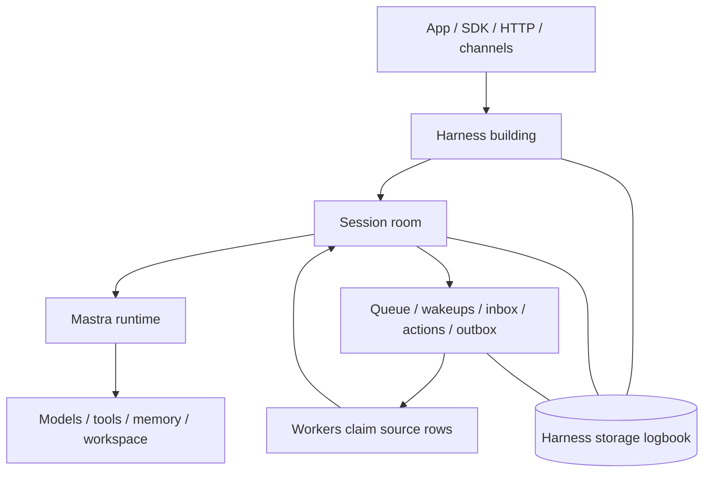
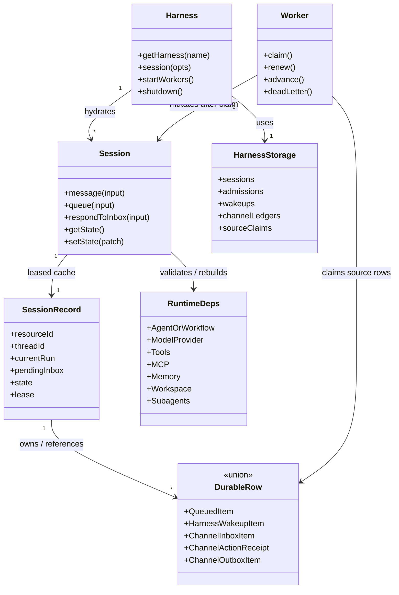

# Harness V1 Implementation Readiness

This file maps the checked Harness v1 spec to the current Mastra codebase. It is
an implementation-planning artifact, not a claim that the current packages have
already changed. The split files under `sections/` remain the spec source of
truth, with tracked claims and outcomes recorded through `issues/`.

Read this file as a gap map onto existing Mastra primitives, not permission to
invent parallel infrastructure. Harness v1 extends the current storage-domain,
request-context, server-route, scheduler, background-task, channel, workspace,
memory, and agent-signal seams where they can carry the contract. When a line
below says "add" a surface, it means "add the v1 adapter/extension required by
the owning section" unless that section explicitly justifies a new primitive.

## Council Decomposition

The review was split into three read-only council workstreams:

- Durable/background lifecycle: durable agents, queue/recovery, wakeups,
  background task executor reconstruction, shutdown, and §15 tests.
- Provider/model/subagent flexibility: per-turn overrides, request context,
  model/provider selection, subagent sessions, workspace/tool/memory ownership,
  and runtime dependency rehydration.
- Harness init/server/channel routing: Mastra registration, init barriers,
  central registry/router, channel binding identity, route ownership, and
  production deployment guarantees.

## Implementation Mental Model

Use §1 as the conceptual model. For implementation, translate it into these
current-code seams:

1. **Building/front desk: new v1 Harness registration.** Add the registered
   Harness surface, `getHarness(...)`, route ownership, readiness, shutdown,
   worker startup, and catalogs for modes, models, tools, memory, workspaces,
   and channels. Keep legacy `packages/core/src/harness` isolated until
   migration is explicit.
2. **Room: durable Session.** Add `SessionRecord` ownership for one
   resource/thread, including state, current mode/model, current run, pending
   inbox items, queue, channel binding, workspace state, and session lease.
3. **Logbook: Harness storage domain.** Add a namespace-bound Harness storage
   domain through Mastra's storage-domain composition model. Session/admission,
   wakeup, channel inbox/action/outbox, binding, claim, retry, dead-letter, and
   projection APIs must reuse shared message/memory rows where the spec says
   they are shared; a Harness-only conversation mirror is not a valid recovery
   boundary.
4. **Staff: source-specific claim/renew/retry workers.** Add workers only for
   source-specific rows that the spec makes claimable: wakeups, channel
   ingress/actions, channel outbox, and reconstructable background tasks. The
   session owner and recovery loop drain `SessionRecord.pendingQueue`; there is
   no generic queue worker or cross-source durable-work worker in v1. A worker
   must stop before further session mutation or provider side effects when it
   cannot renew ownership.
5. **Doors/intercoms: channel bridge.** Translate provider callbacks into
   verified durable inbox/action rows, and provider-visible output into outbox
   rows before dispatch. Live `AgentChannels` delivery is not the Harness-mode
   durability path.
6. **Services in the room: runtime rehydration.** Rebuild or validate agents,
   workflows, models, tools, MCP bindings, memory, request context, attachments,
   workspace state, and subagent sessions before replay. Runtime drift fails
   closed.

This section is an implementation checklist, not a second spec. If this file
conflicts with a detailed section, the detailed section wins and this file
should be updated.

Do not collapse the source-specific rows below into a generic work ledger. v1
intentionally keeps channel, wakeup, queue, inbox-response, and reconstructable
background-task evidence source-specific; `SessionListItem.durableWork`,
`SessionSnapshot.durableWork`, and activity timelines are read projections, not
claim/lookup substrates.

Do not use "heartbeat" as the durable-autonomy bucket. In v1 terminology,
durable scheduled/proactive work is a **wakeup** plus a worker. Heartbeat-style
intervals and liveness loops are process-local unless they create or claim a
durable Harness row.

Compact implementation UML:

## Current Code Baseline

- Current `packages/core/src/harness` is a legacy per-thread orchestrator with
  `sendMessage(...)`, process-local heartbeat timers, `currentThreadId`, and
  in-memory pending resolvers. It is not the v1 stateless `Harness` plus
  durable `Session` model.
- Current `packages/core/src/harness/v1` now provides a local Harness/Session
  baseline: `Harness.session(...)`, `closeSession`, `deleteSession`,
  `listSessions`, `shutdown`, thread CRUD/settings through MemoryStorage,
  model catalog/auth-status reads, event subscription, `Session.message(...)`,
  `signal(...)`, `queue(...)`, `respondToToolApproval`,
  `respondToToolSuspension`, `respondToQuestion`, `respondToPlanApproval`,
  mode/model/state mutation, display snapshots, `listMessages`, skills,
  permissions, subagents, goals, abort, idle waiting, and workspace lifecycle.
- Current `Mastra` has `harnesses?: Record<string, HarnessV1>`,
  `getHarness(name)`, and `getHarnesses()`, plus singular/default
  `harness?: HarnessV1` sugar. Harnesses bind after agents are registered and
  initialize through the Mastra lifecycle readiness path before worker startup;
  `Mastra.shutdown()` now stops registered Harness instances and the background
  task manager.
- Current channel support still includes platform `ChannelProvider` routes and
  legacy `AgentChannels`, but Harness v1 now has channel provider/binding
  registration plus storage ledgers for `ChannelInboxItem`,
  `ChannelActionToken`, `ChannelActionReceipt`, and `ChannelOutboxItem`.
  Source-confirmed runtime support is currently the Harness-owned outbox enqueue
  / per-harness dispatch path plus diagnostics; inbound callback routes,
  cross-harness operator dispatch, repair APIs, and product-specific operator UI
  stay deferred unless Linear records a new scope decision.
- Current Harness storage owns `SessionRecord` rows, session leases,
  attachment metadata/bytes, operation admission/result/tombstone evidence,
  channel ledgers, wakeup rows, and claim/receipt metadata across the core
  in-memory domain, LibSQL adapter, and PG adapter.
- Current `Harness.attachments.upload(...)` and
  `Harness.attachments.delete(...)` are implemented for file, primitive, and
  element refs, with guarded delete and admission validation.
- Current per-turn `HarnessRequestContext` exposes identity, state, workspace,
  subagent, `useSkill(...)`, `registerQuestion(...)`, and
  `registerPlanApproval(...)` helpers.
- Current server packages mount authenticated `/harness/...` routes for session
  create/list/snapshot, attachments, mutations, inbox responses, goal controls,
  state/mode/model/permission updates, channel diagnostics, SSE event replay,
  and message/queue result lookup. `client-js` exports `RemoteHarness` /
  `RemoteSession`; React exports `useHarnessSession` and
  `useRemoteHarnessSession`.
- Current Harness wakeup storage and worker slices use `HarnessWakeupItem` as
  the durable recovery boundary before queue admission; scheduler/pubsub
  acceleration remains separate from the durable row.
- Current `BackgroundTaskManager` still has process-local executor boundaries,
  but Harness-related recovery now fails closed where executor or completion
  policy cannot be rebuilt, and `Mastra.shutdown()` stops the manager.
- Current Harness message, queue, wakeup, and remote-recovery paths have
  admission and ownership boundaries through supported routes/workers.
  `EventedAgent.executeWorkflow(...)` still uses `startAsync({ inputData })`
  without forwarding `requestContext`, and inbound channel callback routes are
  not source-confirmed; any new platform route or workflow path must stay
  disabled until it proves the same `requestContext` forwarding and ownership
  checks.
- Current durable agent execution exposes `signalId` / `runId` admission
  evidence, retained result lookup, and queued-item correlation for message,
  queue, wakeup, and remote recovery flows.

## Remaining Implementation and Release Checks

1. **Release-evidence pass.** §15.2 remains a release gate: every row needs an
   executable test, explicit PR evidence, or an owning §15.3 deferral. PF-376,
   PF-377, and PF-378 added broad core, client attachment, and channel
   acceptance coverage. PF-379 records the current release-evidence ledger
   below; the project still needs each remaining `gap` or
   `open-release-evidence` row closed, explicitly deferred, or backed by
   attached row-level proof before Harness v1 is called complete.
2. **Worker readiness and operator surfaces.** Harness readiness now gates
   route startup and worker initialization, while read-only diagnostics exist
   for session-scoped channel state. Current operator dispatch is the
   per-harness `harness.channels.dispatchOutbox(...)` surface; cross-harness
   operator routes or repair APIs remain deferred by §15.3 and must not be
   inferred from diagnostics.
3. **Background-task reconstruction limits.** Shutdown is wired and recovery
   fails closed for missing executor/completion policy, but background task rows
   remain source-specific diagnostics rather than a generic durable work ledger.
4. **Auth transport and scoped token hardening.** Header/cookie auth and
   resource-scoped Harness routes are implemented, and SSE supports a scoped
   `subscriptionToken` fallback. That fallback must preserve §13.2
   bearer-query-token rejection and must not become a bearer-equivalent URL
   credential.
5. **PapersFlow integration polish.** PapersFlow-facing needs around
   file/primitive/element attachment refs, provider object metadata for
   product-owned blob stores such as R2, observability/OM correlation, action
   catalogs, and workspace journals now have Mastra-side primitives. Remaining
   product-specific read state, notification state, repair UI, and artifact
   browsing are outside v1 unless Linear records a new accepted scope decision.

### PF-379 Release-Evidence Ledger

This ledger is a current-source release map, not a replacement for the §15.2
row text. Status values:

- `covered-by-family` means the cited tests exercise the acceptance family,
  though reviewers may still ask for a narrower row-level assertion before
  release.
- `gap` means current source does not yet satisfy the row and the row remains a
  release blocker unless code lands or Linear records a §15.3 deferral.
- `deferred-by-§15.3` means the row is intentionally outside v1.
- `open-release-evidence` means coverage exists nearby, but the final
  row-by-row proof still needs to be attached before the release is called
  complete.

| §15.2 family | Current PF-379 status | Evidence or next action |
| --- | --- | --- |
| Local Harness/session lifecycle, message admission, queue admission, idempotency, close/delete, drift, and result evidence | `covered-by-family` | `packages/core/src/harness/v1/harness.test.ts`; `packages/core/src/harness/v1/session.message.test.ts`; `packages/core/src/harness/v1/session.queue.test.ts`; `packages/core/src/harness/v1/session.tool-context.test.ts`; `packages/core/src/harness/v1/workspace-registry.test.ts`. |
| File, primitive, and element attachments, including provider object metadata suitable for product-owned blob stores such as R2 | `covered-by-family` | `packages/core/src/harness/v1/attachments.test.ts`; `packages/server/src/server/handlers/harness.test.ts`; `client-sdks/client-js/src/resources/harness.test.ts`. |
| Durable storage/session/lease/admission/channel/wakeup/outbox adapter evidence | `covered-by-family` for core in-memory and LibSQL; `open-release-evidence` for full PG row-level parity | Core in-memory and `stores/libsql` Harness storage tests cover provider callback bindings, inbox/action/outbox rows, claim/renew, action receipts, and wakeup rows. `stores/pg` has Harness schema/session/result/channel/wakeup diagnostics coverage, but final release evidence still needs a row-level PG parity map before claiming complete adapter parity. |
| Server Harness auth, routes, SSE replay, stale/gap `412`, stream cleanup, result lookup, and resource mismatch denial | `covered-by-family` | `packages/server/src/server/handlers/harness.test.ts` covers authenticated Harness route mounting, channel diagnostics, attachment upload, message/queue result lookup, live event streams, stale replay, and resource mismatch denial. |
| Client JS and React remote Harness session recovery, Last-Event-ID replay, result lookup fallback, attachment refs, diagnostics, and unsubscribe cleanup | `covered-by-family` | `client-sdks/client-js/src/resources/harness.test.ts`; `client-sdks/react/src/harness/hooks.test.tsx`. |
| Harness channel registry, provider callback binding storage, durable inbox/action/outbox rows, per-harness outbox dispatch, and read-only diagnostics | `covered-by-family` for storage, registry, per-harness dispatch, and diagnostics; `gap` for externally reachable inbound/action callback route workers | `packages/core/src/harness/v1/channel-registry.ts`; `packages/core/src/harness/v1/harness.test.ts`; storage-domain tests; server/client diagnostics tests. `packages/server/src/server/server-adapter/routes/harness.ts` has no provider callback or channel action callback route today, and `packages/core/src/worker/worker.test.ts` has no channel ingress/action worker family. |
| Wakeup/background recovery | `covered-by-family` for `HarnessWakeupWorker`; `open-release-evidence` for any generic background-task reconstruction claim | `packages/core/src/worker/worker.test.ts` covers wakeup claim/retry/binding behavior. Generic background-task rows remain source-specific diagnostics unless executor/completion policy is reconstructable. |
| Evented workflow request context | `gap` | `packages/core/src/agent/durable/evented-agent.ts` still calls `run.startAsync({ inputData })` without forwarding persisted `requestContext`, so §15.2 Evented workflow request-context coverage is not satisfied. |
| Cross-harness operator channel dispatch | `deferred-by-§15.3` unless Linear records new v1 scope | Current dispatch is per-harness `harness.channels.dispatchOutbox(...)`; no `mastra.harnessChannels.dispatchOutbox(...)` surface is source-confirmed. |
| First-class durable artifacts, generic MCP/app callback ledgers, generic non-read external receipts, generic durable work ledger, closed-session GC/history retention, per-principal read/notification state, richer stream/result/typed-generate schemas, and product repair UI | `deferred-by-§15.3` | See §15.3. These rows must not be implied by diagnostics, result lookup, or source-specific storage rows. |
| Final row-by-row §15.2 release proof | `open-release-evidence` | Before release, attach a row-level evidence map that names each row, the executable test or PR evidence that satisfies it, or the owning §15.3 deferral. |

## Implementation Mapping Checks

- These are not spec-roadmap blockers. They are implementation-time checks for
  mapping the settled section specs onto current Mastra module boundaries,
  exported types, defaults, and server lifecycle hooks.
- **Primitive reuse guard.** Before adding a new class, storage table, worker,
  route family, or event channel, map it to the existing Mastra primitive named
  in `OBJECTIVES.md` and §11.6. If the primitive cannot carry the v1 invariant,
  the owning section must already state that gap; this readiness file is not
  enough.
- **Legacy coexistence.** Carry forward the settled `@mastra/core/harness/v1`
  subpath layout while keeping current `@mastra/core/harness` legacy exports
  untouched.
- **V1 `HarnessConfig`.** Translate the concrete config shape for modes, sessions,
  storage, request-context policy, channels, workspace ownership, worker config,
  provider/model resolution, and production-durable requirements.
- **`HarnessChannelConfig` and adapter contract.** Translate the per-channel
  config and adapter methods required beyond current `ChannelProvider`: inbound
  verification, action verification, delivery, reconciliation, capability
  reporting, and delivery-semantics selection.
- **Provider callback bindings.** Specify the storage/config/provisioning surface
  for provider-owned callback selectors instead of leaving them as conceptual
  registry rows.
- **Harness identity.** Declare the canonical persisted identity rule for
  `harnessName` versus any config `id` so storage rows, routes, and registry keys
  cannot diverge.
- **Route prefix integration.** Map the settled `/harness/...` wire sketch onto
  the actual Mastra Server API-prefix and route-builder mechanics.
- **Route auth transport boundary.** Enforce the §13.2 Auth transport rule on
  the Harness route lane independently of the shared Mastra Server auth
  wrapper. Current shared auth reads `?apiKey=` as a bearer-equivalent token
  (`packages/server/src/server/server-adapter/index.ts` query fallback) and
  writes the resolved credential into `mastra__authToken`
  (`packages/server/src/server/auth/helpers.ts`, keyed by
  `MASTRA_AUTH_TOKEN_KEY` /
  `packages/core/src/request-context/index.ts`). Reusing that wrapper on
  Harness routes is allowed only when the lane separately rejects
  bearer/API-equivalent query parameters before principal resolution, keeps
  query-derived tokens out of `mastra__authToken`, persisted request context,
  admission hashes, and downstream forwarding, and treats any scoped per-session
  events subscription token as read-only, route-scoped, and never as
  `RequestContext` auth. Existing non-Harness routes are out of scope for this
  check.
- **Worker ownership knobs.** Map the configured inbox/action/outbox/wakeup
  worker knobs onto worker startup, ownership scope, concurrency, claim renewal,
  drain, and shutdown code.
- **Background task executor metadata.** Either define stable executor metadata
  fields and registry lookup, or explicitly keep raw background tasks as
  non-durable machinery behind owning Harness rows for v1.
- **Projection and binding storage APIs.** Ensure section storage interfaces name
  `listActiveChannelBindingsForScope(...)` and the exact invocation contract for
  `projectMissingOutboxItems(...)`.
- **Server adapter extension point.** Link §13 routes to the existing
  `packages/server` route-builder/handler pattern so implementation does not
  invent a parallel HTTP stack.
- **Existing background task lifecycle.** Include `BackgroundTaskManager`
  shutdown in Mastra shutdown while adding Harness-owned worker drain.

## Completed Project Phases and Release Tail

1. **Foundations.** V1 module boundaries, storage interfaces, in-memory storage,
   error classes, and focused storage tests are present.
2. **Session core.** `Harness.session(...)`, durable `Session`, leases,
   queue/idempotency, pending response receipts, and lifecycle close/delete are
   implemented.
3. **Runtime integration.** `Session.message(...)` / `queue(...)` route through
   durable agent execution with current-run evidence and runtime-drift
   fail-closed checks. Request-context preservation is proven for the supported
   Harness paths; the raw EventedAgent `startAsync` path remains an explicit
   mapping check before it can be used for trusted channel-origin work.
4. **Subagents and flexibility.** Subagents use first-class child sessions,
   serializable per-turn mode/model/yolo/request-context overrides are
   preserved, and workspace/tool/memory ownership is checked on resume.
5. **Mastra/server lifecycle.** Harness registration, default sugar, readiness,
   shutdown, server route mounting, and API-prefix policy are implemented.
6. **Channel registry.** Registry validation, provider callback binding,
   legacy AgentChannels fencing, and shared-provider tests are implemented.
7. **Channel storage and outbox.** Registry/binding support,
   inbox/action/outbox ledgers, outbox projection, per-harness dispatch, retry
   metadata, and diagnostics are implemented within the v1 scope. Inbound
   callback routes, cross-harness operator dispatch, and repair APIs remain
   deferred unless Linear records new scope.
8. **Wakeups and background execution.** `HarnessWakeupItem` storage/workers,
   background-task reconstruction restrictions, and background-task manager
   shutdown are implemented.
9. **Acceptance and release evidence.** §15.2 coverage is now incremental
   release evidence rather than an unstarted phase. Keep this matrix current
   after upstream syncs and any follow-up PRs that change Harness behavior.
