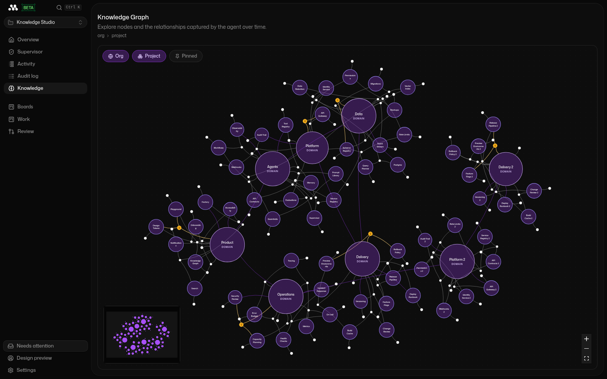
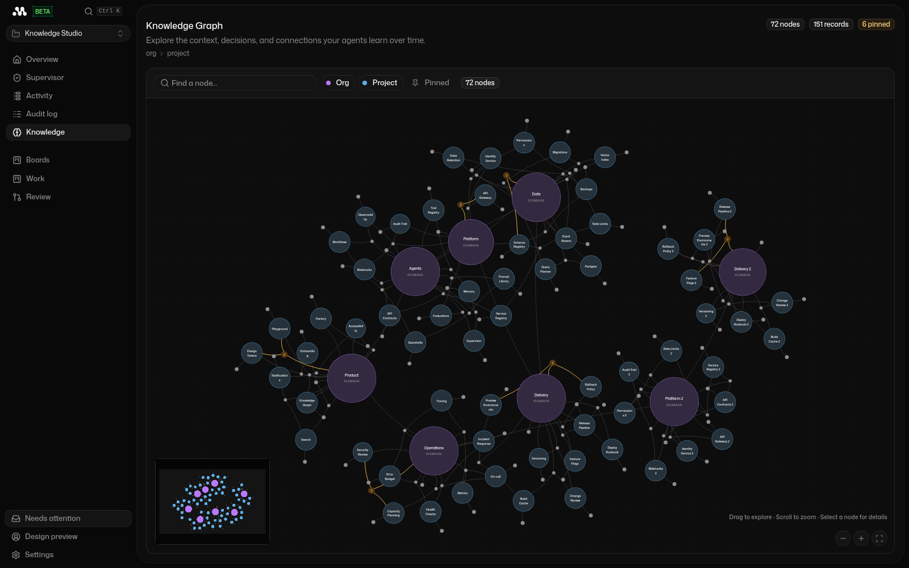
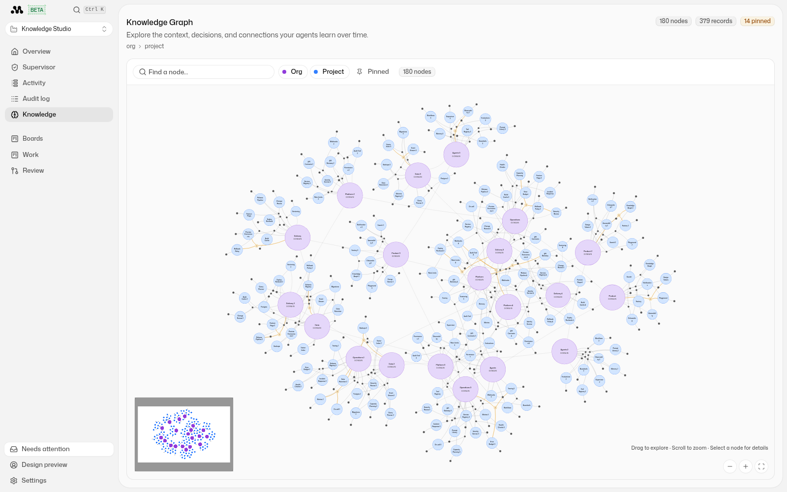

# Knowledge design preview

Run the actual Factory SPA with deterministic local API responses:

```sh
pnpm --dir mastracode/factory-ui dev:knowledge
```

Open <http://localhost:5173/__knowledge-preview?nodes=72>.
Use `nodes=18` for a small graph, `nodes=180` for a dense graph, or up to
`nodes=240` for a stress preview. The dataset size is stored in a local cookie;
refreshing and switching between project and session views preserves it.

The preview uses the production router, factory sidebar, React Query hooks,
knowledge graph, and detail panel. Only API responses are replaced by the
explicitly enabled, development-only Vite middleware. No GitHub connection,
database, model credentials, or Docker services are needed. Mutations are
disabled. Normal development and production builds do not enable this middleware.

Search for a node to focus its neighborhood. Select a record to inspect its
provenance and follow its session link to preview session-scoped knowledge.
Use Settings to switch the app theme, and the scope and pinned filters to
inspect subsets. The minimap, zoom controls, node dragging, and fit control
use the real graph implementation. Motion respects reduced-motion preferences.

If workspace imports are missing, build the workspace dependencies first with
`pnpm turbo build --filter ./mastracode/factory-ui`.

## Design captures

Before, with 72 sample nodes:



After, with the same 72-node dataset:



Light mode, with 180 sample nodes:


