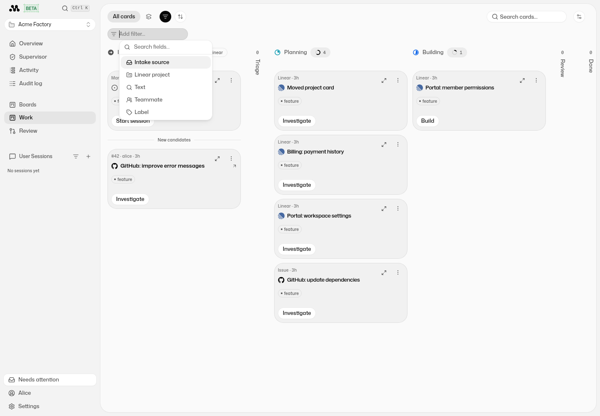
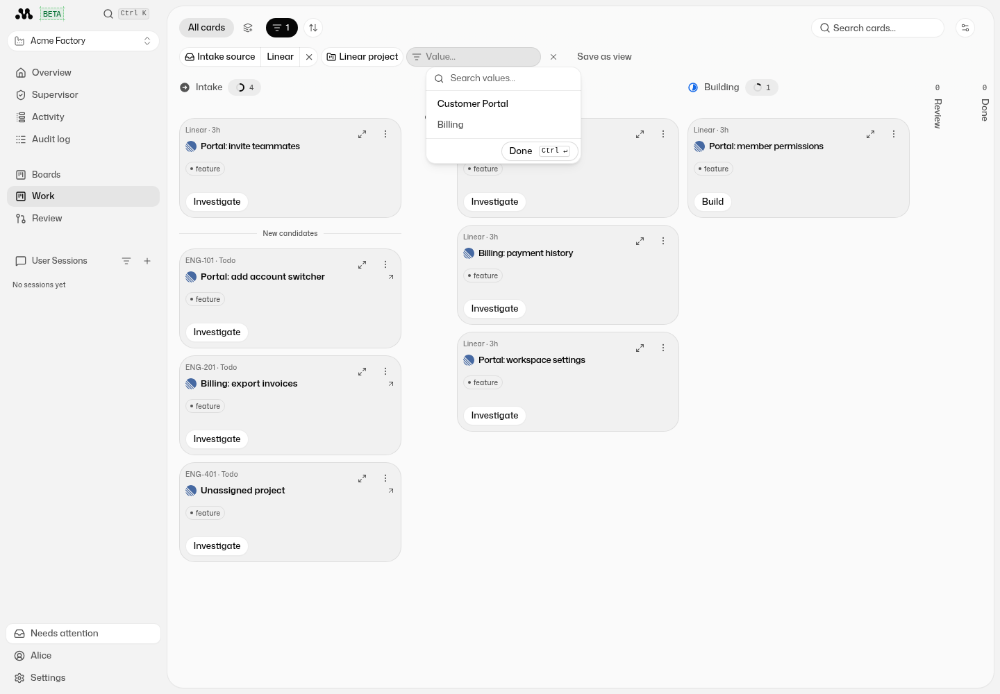
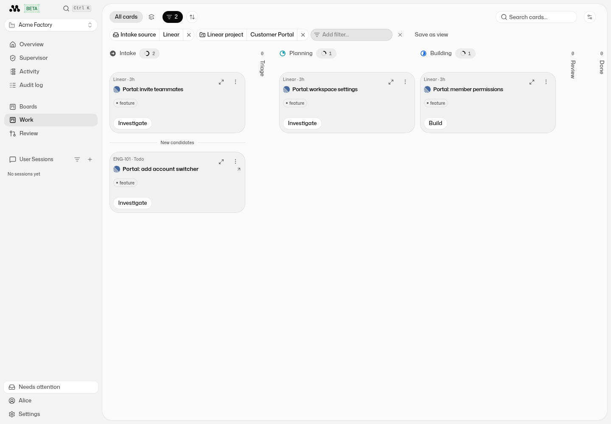
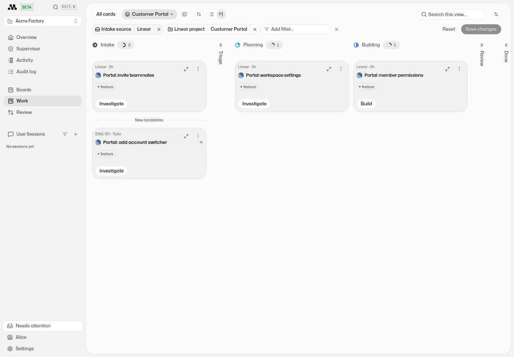
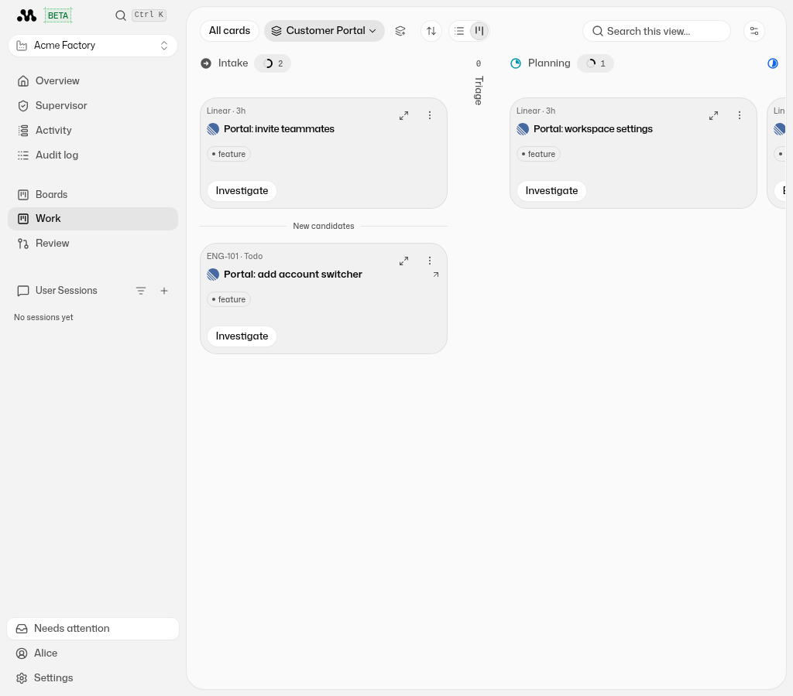
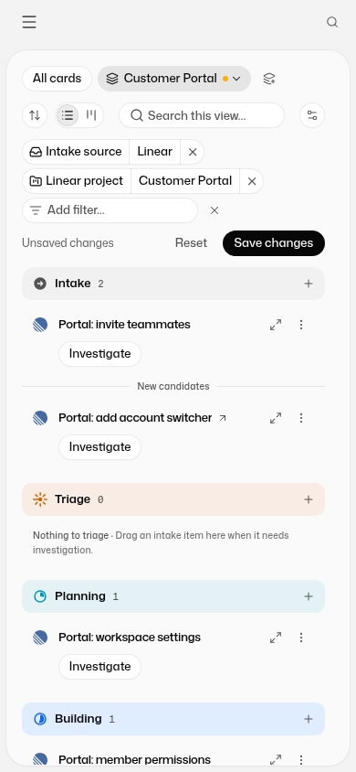

# Board source and Linear project filters

Captured from the running Factory UI using the fixtures in [`boardSourceFilters.ts`](../../../src/ui/__tests__/fixtures/boardSourceFilters.ts). The data includes GitHub, manual, and Linear cards from two projects, plus an issue routed through a Linear team. Screenshots contain fixture data rather than customer data.

1. **New filter fields** — open **Filter cards**, then **Add filter**. **Intake source** and **Linear project** join the existing board filters.
   
2. **Project picker** — select projects by their names. Multiple projects can be selected; team-routed issues match their actual Linear project.
   
3. **Whole-board filtering** — Linear + Customer Portal leaves two Intake cards, one Planning card, and one Building card. GitHub, manual, and Billing cards are excluded, and column counts follow the filtered cards. **Save as view** stores these filters.
   
4. **Saved view after reload** — the Customer Portal view restores the same cards. Opening **Edit view** shows the saved source and project filters.
   
5. **Tablet** — saved project view at 1024 × 900.
   
6. **Mobile** — editing the same project's saved view in the existing List layout at 390 × 844; both filter chips wrap within the viewport.
   
