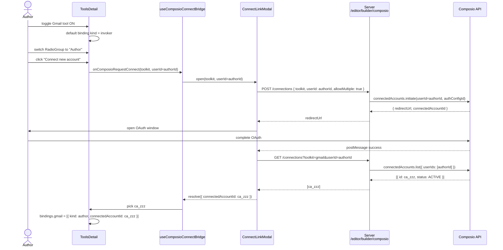
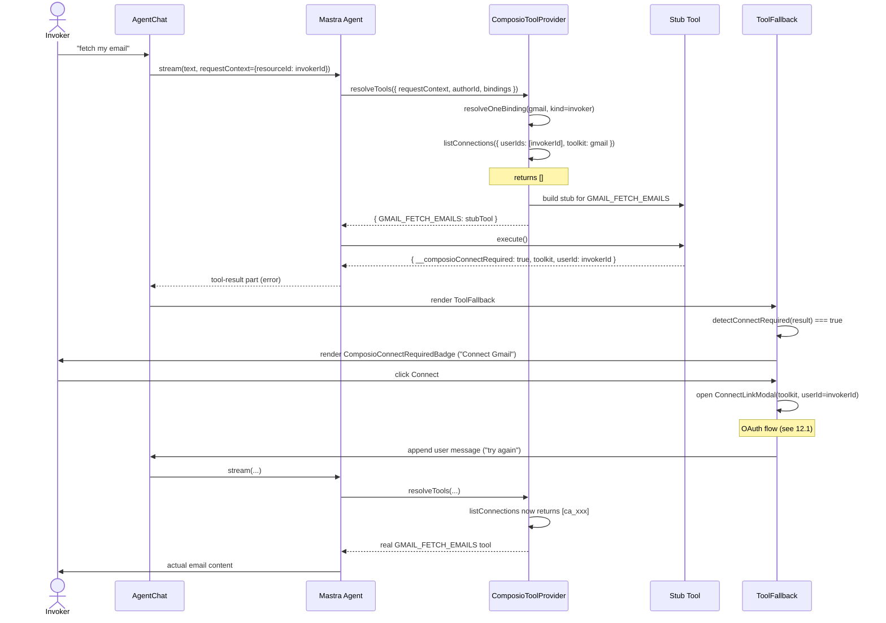
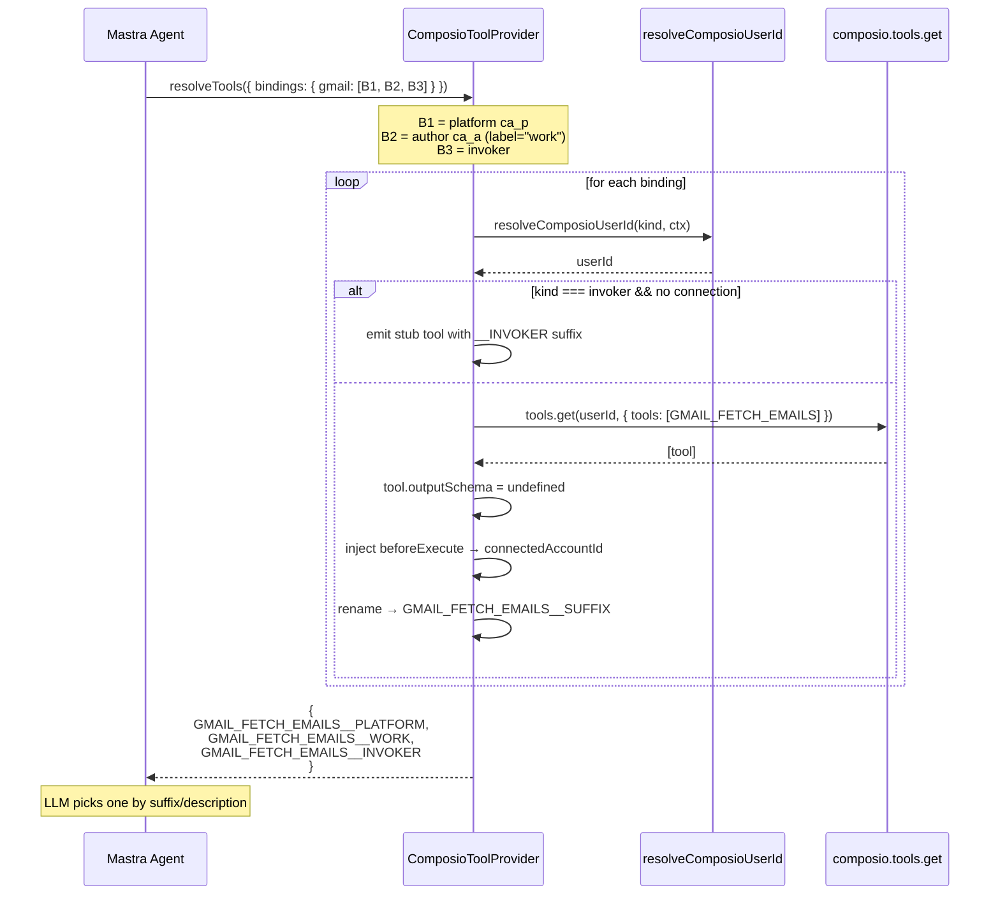
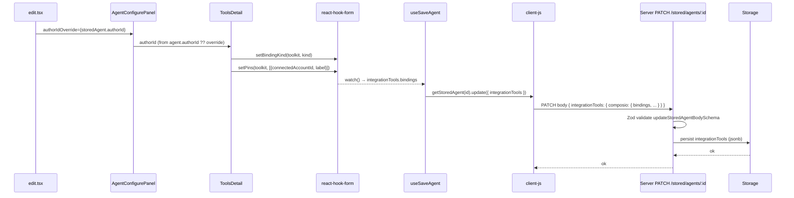
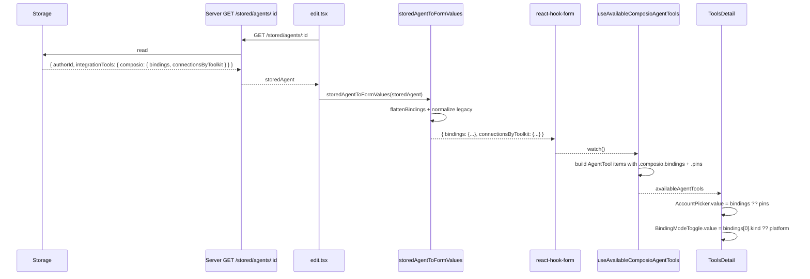

# Composio Integration — How It Works

End-to-end report covering config, storage, runtime, UI, and auth modes.
Read this when onboarding to the integration or before changing any layer.

---

## 1. Mental Model

Composio's core primitive:

```
(userId, connectedAccountId, toolSlug) → result
```

Everything in the integration boils down to resolving those three values
before a tool call and threading them into `@composio/mastra`'s
`composio.tools.get(userId, { tools, modifiers })`.

Three orthogonal pieces:

| Concern              | Owner                                | Layer    |
| -------------------- | ------------------------------------ | -------- |
| `userId`             | Auth mode (platform / author / invoker) | Runtime  |
| `connectedAccountId` | Pinned by admin/author, or late-bound | Storage  |
| `toolSlug`           | Catalog selection in builder UI      | Author-time |

---

## 2. Configuration

### 2.1 Registry (admin code)

Configured under `editor.builder.registries.composio` in `Mastra` config.

```ts
new Mastra({
  editor: {
    builder: {
      registries: {
        composio: {
          enabled: true,
          apiKey: process.env.COMPOSIO_API_KEY,
          platformUserId: 'platform',
          authConfigs: { gmail: 'ac_HN_uDi_5CKBs' }, // optional pin
          autoProvisionManagedConfigs: false,
          allowToolkits: ['gmail', 'slack'], // optional gate
        },
      },
    },
  },
});
```

- `platformUserId` — the shared user for platform-mode connections.
- `authConfigs[toolkit]` — pins a specific `ac_xxx` per toolkit. If unset,
  the registry auto-discovers from Composio (errors if 0 or >1 active).
- `autoProvisionManagedConfigs` — if true, lets the registry mint a
  managed auth config when none exists.
- `allowToolkits` — narrows the catalog. Empty/undefined = all.

### 2.2 Permissions

Two roles are checked server-side:

- `composio:read` — view catalog, list connections, view health
- `composio:write` — initiate connections, use platform mode

---

## 3. Storage Shape

Stored on each agent under `integrationTools.composio`:

```ts
{
  composio: {
    enabledTools: ['GMAIL_FETCH_EMAILS', 'GMAIL_SEND_EMAIL'],
    bindings: {
      gmail: [
        { kind: 'author',   connectedAccountId: 'ca_xxx', label?: 'work' },
        { kind: 'platform', connectedAccountId: 'ca_yyy' },
        { kind: 'invoker',  label?: 'end-user' },
      ],
    },
    // legacy, normalized on read; still written for back-compat:
    connectionsByToolkit: { gmail: [{ connectedAccountId: 'ca_xxx', label: 'work' }] },
  },
}
```

Key invariants:

- `bindings` is keyed by **toolkit slug** (not tool slug).
- Each toolkit can have **multiple bindings** of any kind.
- `platform` / `author` bindings pin `connectedAccountId` at author-time.
- `invoker` bindings are **late-bound** — resolved at run-time per caller.
- `connectionsByToolkit` is the legacy shape (pre-Phase 7.1). Normalizer
  in `core/agent-builder/ee/composio-bindings.ts` converts it to platform
  bindings on read; mappers still write it for a few releases.

---

## 4. Auth Modes

Three `ConnectionBinding.kind` values resolve `userId` differently:

| Kind     | `userId` source                   | `connectedAccountId` source         | Use case                       |
| -------- | --------------------------------- | ----------------------------------- | ------------------------------ |
| platform | `registry.platformUserId`         | pinned in binding                   | shared/service agents, demos   |
| author   | `agent.authorId`                  | pinned in binding (author's `ca_xxx`) | personal agents, author-owned data |
| invoker  | `requestContext[MASTRA_RESOURCE_ID_KEY]` | looked up at runtime per invoker | team-shared agents w/ per-user data |

Isolation:

- Each `userId` namespace is independent in Composio.
- Author connections do **not** appear when listing platform connections.
- `initiateConnection` accepts an optional `userId` so OAuth-minted
  accounts land in the correct namespace.

Default for new agents (Phase 7.4): `invoker`.
Platform mode is gated behind `composio:write`.

---

## 5. Server Routes

All under `/editor/builder/composio/*`, gated by `composio:read` or
`composio:write` permissions.

| Method | Path                  | Purpose                                          |
| ------ | --------------------- | ------------------------------------------------ |
| GET    | `/toolkits`           | List allowed toolkits with auth-config status     |
| GET    | `/tools?toolkit=...`  | List tool slugs for a toolkit                    |
| GET    | `/connections?toolkit=...&userId=...` | List `ca_xxx`s scoped to user        |
| POST   | `/connections`        | Initiate OAuth; accepts `{ toolkit, userId?, allowMultiple? }` |
| GET    | `/health?userId=...`  | Wiring diagnostic (auth source, account counts)  |

`userId` defaults to `platformUserId` when omitted.

---

## 6. UI Surfaces

### 6.1 Builder Tools row (`tools-detail.tsx`)

Per-toolkit, per-checked-tool UI:

- **`BindingModeToggle`** — RadioGroup for Invoker / Author / Platform.
  Platform option is disabled unless user has `composio:write`.
- **`AccountPicker`** — multi-select of `ca_xxx`s, scoped by
  `userId` derived from binding kind (author=`authorId`, platform=`undefined`).
  Each pin gets an optional editable label.
- **`ComposioHealthPill`** — registry/connection diagnostic in the row header.

### 6.2 Inline connect flow

- `BindingModeToggle` writes to `form.bindings[providerId:toolkit]`.
- Clicking "Connect new account" opens `ConnectLinkModal` via
  `useComposioConnectBridge`. The bridge plumbs `userId` based on
  current binding kind, so minted accounts land in the right namespace.

### 6.3 Runner UI (`tool-fallback.tsx`)

When a tool result matches the Composio "connection required" payload
(`__composioConnectRequired: true` or message regex match):

- Renders `ComposioConnectRequiredBadge` instead of the default error.
- Opens `ConnectLinkModal` on click.
- On successful OAuth, appends a user message to the thread to retry.

---

## 7. Runtime Flow

### 7.1 Resolution (`packages/editor/src/providers/composio.ts`)

`ComposioToolProvider.resolveTools(options)`:

1. Read stored `bindings` (normalizing legacy `connectionsByToolkit`).
2. Group enabled tools by toolkit slug.
3. For each `(toolkit, binding)` pair, call `resolveOneBinding`:
   - Resolve `userId` via `resolveComposioUserId` based on `binding.kind`:
     - `platform` → `registry.platformUserId`
     - `author`   → `options.authorId` (throws if missing)
     - `invoker`  → `requestContext[MASTRA_RESOURCE_ID_KEY]` (throws if missing)
   - Resolve `connectedAccountId`:
     - `platform`/`author` → from `binding.connectedAccountId`
     - `invoker` → look up active connection via `listConnections({ userIds: [invokerId], toolkit })`
   - Fetch tools via `composio.tools.get(userId, { tools: [...] })`.
   - Inject `modifiers.beforeExecute` to set `connectedAccountId` per call.
   - Mutate `tool.outputSchema = undefined` to bypass `@composio/mastra`
     output validation mismatch.
   - Rename tools with binding suffix when toolkit has >1 binding:
     `GMAIL_FETCH_EMAILS__WORK`, `GMAIL_FETCH_EMAILS__INVOKER`, etc.
4. Return the flat tools map to the agent.

### 7.2 Invoker without a connection

Returns a **stub tool** that errors on execute with a structured
`ComposioConnectionRequiredError` payload. Stub message format:

```
Composio toolkit "<x>" has no active connection for invoker "<invokerId>".
```

The runner UI catches it and renders the inline connect badge.

---

## 8. Key Files

| File                                                              | Purpose                                  |
| ----------------------------------------------------------------- | ---------------------------------------- |
| `packages/core/src/agent-builder/ee/composio-bindings.ts`         | `ConnectionBinding` types + normalizer   |
| `packages/core/src/agent-builder/ee/composio-user-id.ts`          | `resolveComposioUserId` switch           |
| `packages/core/src/agent-builder/ee/composio-connections.ts`      | `listConnections`, `initiateConnection`  |
| `packages/core/src/agent-builder/ee/composio-health.ts`           | `getComposioHealth` diagnostic           |
| `packages/editor/src/providers/composio.ts`                       | Runtime tool resolution + fan-out        |
| `packages/server/src/server/handlers/editor-builder-composio.ts`  | Route handlers                           |
| `packages/server/src/server/schemas/stored-agents.ts`             | Storage Zod schemas (`bindings` field)   |
| `packages/playground/src/domains/composio/`                       | UI components + hooks                    |
| `packages/playground/src/domains/agent-builder/components/agent-builder-edit/details/tools-detail.tsx` | Builder Tools UI |
| `packages/playground/src/lib/ai-ui/tools/tool-fallback.tsx`       | Runner inline connect detection          |

---

## 9. Common Pitfalls

- **`userId` mismatch** — pinning a `ca_xxx` that belongs to a different
  user than the binding kind resolves to. Caused the last bug:
  `initiateConnection` minted under `platformUserId` while UI was in
  Author mode. Fix: thread `userId` through the connect flow based on
  binding kind.
- **`outputSchema` mismatch** — `@composio/mastra` declares
  `error: string` but Composio returns `error: null` on success. Provider
  mutates `tool.outputSchema = undefined`. Upstream fix pending.
- **Legacy `connectionsByToolkit`** — still written for back-compat but
  not the source of truth. UI reads from `bindings` first.
- **Stale CLI bundle** — `packages/cli/dist/studio/` is a copied snapshot
  of `packages/playground/dist/`. Rebuild CLI after Playground changes.
- **Multiple active auth configs** — registry errors if a toolkit has 0
  or >1 active `ac_xxx` and no explicit pin. Pin via
  `authConfigs[toolkit]` or set `autoProvisionManagedConfigs: true`.

---

## 10. End-to-End Example: Author-mode Gmail

1. **Admin** sets `authConfigs.gmail = 'ac_xxx'` in `Mastra` config.
2. **Author** opens builder, toggles `GMAIL_FETCH_EMAILS` on.
3. UI defaults binding kind to `invoker`. Author switches to `author`.
4. `AccountPicker` shows connections scoped to `authorId` (empty).
5. Author clicks "Connect new account" → `ConnectLinkModal` POSTs
   `/connections` with `{ toolkit: 'gmail', userId: authorId }`.
6. OAuth completes. New `ca_zzz` is minted under `authorId`.
7. Author selects `ca_zzz` in picker → `bindings.gmail = [{ kind: 'author', connectedAccountId: 'ca_zzz' }]`.
8. Agent saved. **End-user** opens agent and asks "fetch my email".
9. Runtime: `resolveTools` resolves `userId = authorId`,
   `connectedAccountId = ca_zzz`, fetches `GMAIL_FETCH_EMAILS`, returns
   author's inbox.

---

## 11. Status

- ✅ Phase 1–6 shipped (config, catalog, connections, builder UI, runtime, health).
- ✅ Phase 7 shipped (bindings model, author + invoker modes, default flip, admin gate).
- ⏳ Phase 8 (per-tool bindings) — design only, not implemented.

---

## 12. Sequence Diagrams

### 12.1 Author-mode: connect a new account

The flow that caused yesterday's bug. Key point: `userId` must be
threaded from the binding kind all the way to `POST /connections`.



---

### 12.2 Runtime: invoker-mode tool call with no connection

The recoverable-error path. Provider returns a **stub tool** instead of
throwing at resolve time, so the LLM sees a normal tool result and the
UI can render the inline connect badge.



---

### 12.3 Runtime: multi-account fan-out

How one toolkit with multiple bindings becomes multiple renamed tools
for the LLM.



---

### 12.4 Save path: builder form → storage

Where `userId`/`authorId`/`bindings` enter persistence. The bug fix
yesterday was at the **`authorId` plumbing** step — without it the
connect button defaulted to platform mode.



---

### 12.5 Initial load: storage → form

The reverse path. Note `bindings` is the source of truth; legacy
`connectionsByToolkit` is normalized into bindings on read.



---

## 13. Glossary

- **Toolkit** — Composio's grouping of tools (e.g. `gmail`, `slack`).
- **Auth config (`ac_xxx`)** — toolkit-level OAuth app credentials.
- **Connected account (`ca_xxx`)** — per-user account minted via OAuth.
- **Binding** — author-time decision of how a toolkit resolves at runtime.
- **Platform user** — registry-wide shared `userId` (e.g. `'platform'`).
- **Author** — agent owner (`agent.authorId`).
- **Invoker** — end-user calling the agent at runtime
  (`requestContext[MASTRA_RESOURCE_ID_KEY]`).

---

## 14. Agent-level auth mode (Phase 7.5)

Auth mode now lives **on the agent**, not on each binding. The per-toolkit
`kind` field stays in storage for forward-compat with a future "mixed" mode,
but UI and runtime treat all bindings under one agent uniformly.

### Storage shape

```ts
StorageStoredAgent {
  integrationTools: {
    [providerId]: {
      authMode?: 'fixed' | 'invoker'        // top-level
      authIdentity?: 'author' | 'platform'  // reserved; only 'author' in v1
      bindings: Record<toolkit, ConnectionBinding[]>
    }
  }
}
```

- `authMode = 'invoker'` (default for new agents) — each end-user connects
  their own account. Bindings are emitted without `connectedAccountId`.
- `authMode = 'fixed'` + `authIdentity = 'author'` — uses the agent author's
  pinned `connectedAccountId`. `platform` identity is reserved for a future
  admin path.

### Runtime

`resolveEffectiveAuthMode(providerConfig)` reads the top-level fields and
falls back to the first binding's `kind` for back-compat (no migration
write). `ComposioToolProvider.resolveOneBinding` calls this once per
resolve, then routes:

| Mode      | Identity   | `userId`              | `connectedAccountId`          |
|-----------|------------|-----------------------|-------------------------------|
| `fixed`   | `author`   | `authorId`            | `binding.connectedAccountId`  |
| `fixed`   | `platform` | `platformUserId`      | `binding.connectedAccountId`  |
| `invoker` | —          | `MASTRA_RESOURCE_ID`  | resolved at run-time          |

### UI

Single agent-level radio at the top of the Tools panel (`Invoker` / `Fixed
(your account)`). `AccountPicker` is only rendered when mode is `fixed`.
Switching mode is fully editable. If the existing bindings have pinned
`connectedAccountId`s that conflict with the new mode, the mapper clears
them on save and the user re-pins. In-flight chat keeps already-resolved
tools; the next session re-resolves with the new mode.

### Memory `resourceId` alignment

Memory `resourceId` follows the agent's auth mode so it lines up with the
Composio `userId`:

- `invoker` → `resourceId = currentUser?.id ?? agentId`
  (per-user thread history; fixes `validateThreadOwnership` 403)
- `fixed`   → `resourceId = agentId` (shared history)

Applied in `MastraRuntimeProvider`, `pages/agents/agent/index.tsx`, and
`pages/agents/agent/session.tsx` via `resolveEffectiveAuthMode` against the
agent's `integrationTools[providerId]`.
