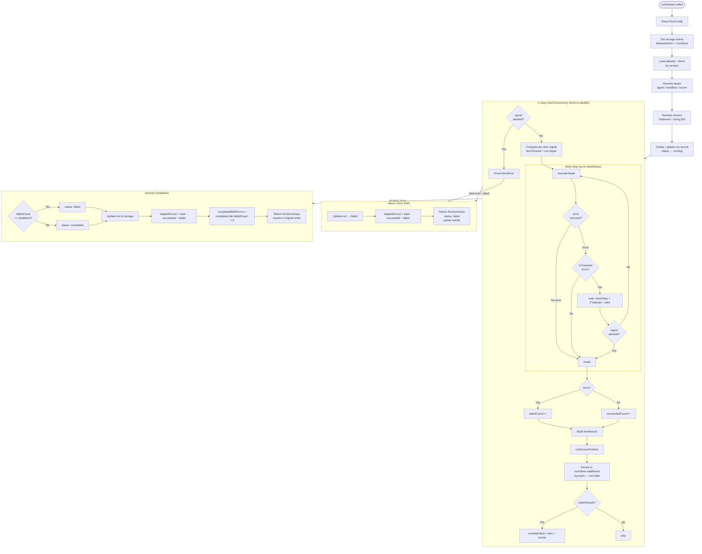
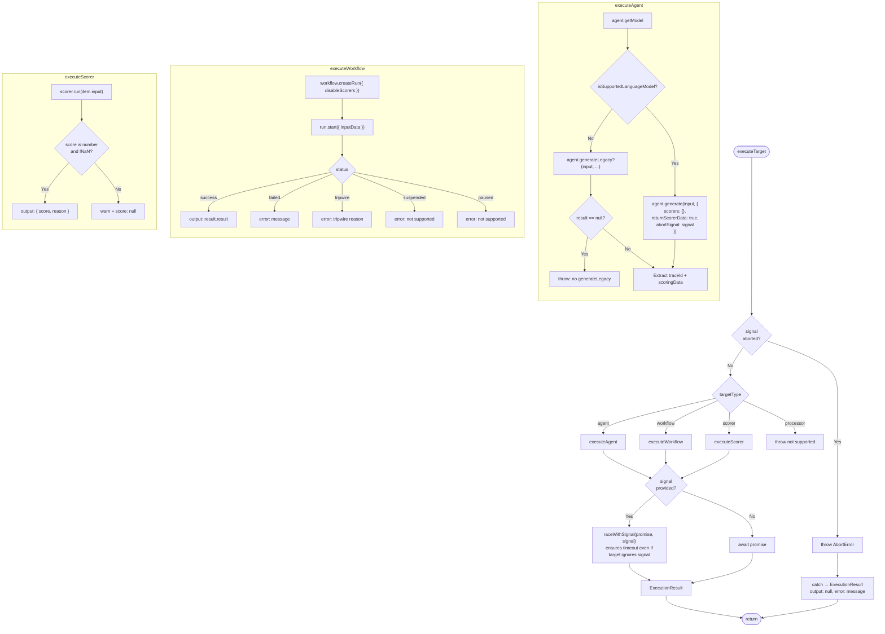
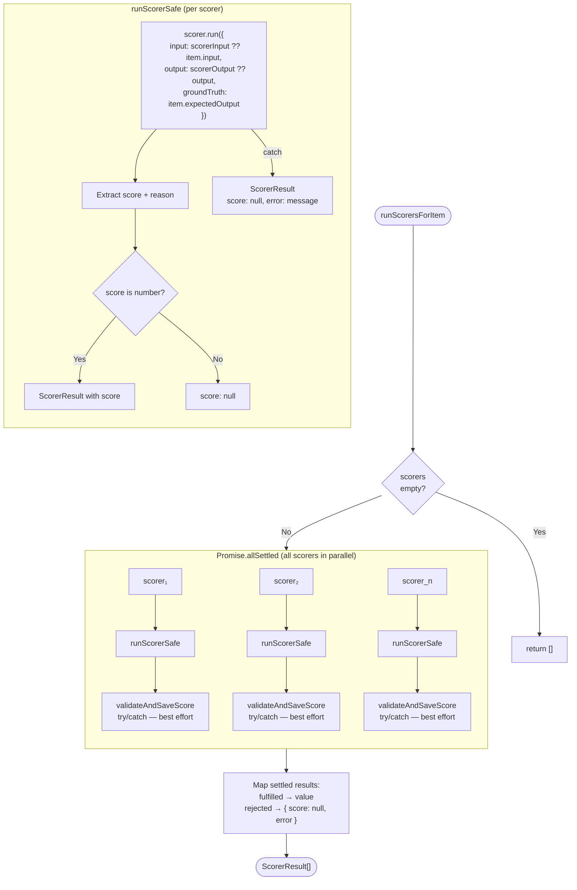
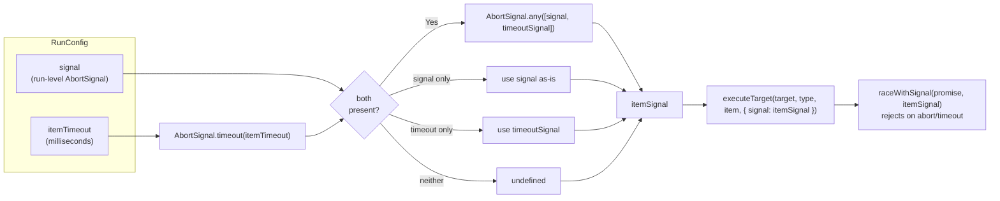
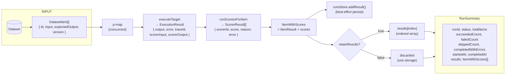

# Dataset Run Executor — Architecture

## High-Level Flow

The main `runDataset` function orchestrates the entire run lifecycle: loading the dataset, resolving the target and scorers, then processing each item concurrently via `p-map`. Each item goes through an optional retry loop, scoring, and storage persistence before contributing to the final `RunSummary`. Abort and errors produce a partial summary instead of throwing.

## executeTarget Dispatch

Routes a single dataset item to the correct executor (agent, workflow, or scorer). Handles the `raceWithSignal` guard that ensures per-item timeouts are enforced even when the target ignores the abort signal. All errors are caught and returned as `{ output: null, error }` — this function never throws.

## Scorer Pipeline

After each item is executed, its output is scored by all configured scorers **in parallel** via `Promise.allSettled`. Each scorer runs in isolation — one scorer failing doesn't affect the others. Score persistence to storage is best-effort (errors are warned, not thrown).

## Signal & Timeout Composition

Shows how the run-level `AbortSignal` and per-item `itemTimeout` are composed into a single signal per item. Uses `AbortSignal.timeout()` and `AbortSignal.any()` (Node ≥22.13). The composed signal is passed to `executeTarget` and ultimately to `agent.generate()` via `abortSignal`. Note: `workflow.start()` does not accept a signal — timeout is enforced externally via `raceWithSignal`.

## Data Flow

End-to-end data shape from dataset input to `RunSummary` output. Each item flows through execution → scoring → dual persistence (storage + in-memory). The `retainResults` flag controls whether results accumulate in memory or are only persisted to storage, allowing large runs to avoid heap pressure.

