# @mastra/server CLAUDE.md

## Auth & Route Protection Architecture

There are three categories of routes with different auth behavior:

1. **Built-in SERVER_ROUTES** (agents, workflows, memory, auth, etc.) — registered under the `/api` prefix via `registerRoutes()`. Each route calls `checkRouteAuth(route, ...)` inline. Auth-related routes use `createPublicRoute()` which sets `requiresAuth: false`.

2. **Custom API routes** (user-defined `server.apiRoutes[]`) — recorded in `customRouteAuthConfig` Map at startup. **Default `requiresAuth = true`** unless the route explicitly sets `requiresAuth: false`. Get their own per-route auth middleware in `registerCustomApiRoutes()`.

3. **Non-API paths** (`/`, `/agents`, `/assets/*`) — studio UI and static files. Not registered in either route system. Served by the Hono catch-all `app.get('*')` handler that returns `index.html`. These are intentionally unprotected so the studio login page can load.

### Default auth config (`defaults.ts`)

```
protected: ['/api/*']
public:    ['/api', '/api/auth/*']
rules:     [admin users → allow]
```

### Request Auth Flow

```mermaid
flowchart TD
    subgraph STARTUP["Server Startup (init)"]
        direction TB
        S1["User defines <b>custom API routes</b><br/>in mastra server config<br/><i>server.apiRoutes[]</i>"]
        S2["Each custom route recorded in<br/><b>customRouteAuthConfig</b> Map<br/><i>key: 'METHOD:/path' → bool</i>"]
        S3["Default: <b>requiresAuth = true</b><br/>unless route sets <i>requiresAuth: false</i>"]
        S1 --> S2 --> S3

        S4["Framework registers built-in<br/><b>SERVER_ROUTES[]</b><br/><i>agents, workflows, memory, auth, etc.</i>"]
        S5["Each built-in route created via<br/><b>createRoute()</b> or <b>createPublicRoute()</b>"]
        S6["createPublicRoute sets<br/><i>requiresAuth: false</i> on route object"]
        S4 --> S5 --> S6
    end

    REQ["Incoming HTTP Request<br/><i>e.g. GET /api/agents/123</i>"]

    REQ --> GATE1

    subgraph PER_ROUTE["Per-Route Auth Gate (checkRouteAuth)"]
        GATE1{"<b>server.auth</b><br/>configured?"}
        GATE1 -- "No auth config" --> PASS_NOAUTH["PASS<br/><i>No auth required at all</i>"]

        GATE1 -- "Yes" --> GATE2{"Route has<br/><b>requiresAuth: false</b>?"}
        GATE2 -- "Yes<br/><i>(createPublicRoute or<br/>custom route opt-out)</i>" --> PASS_PUBLIC_ROUTE["PASS<br/><i>Route explicitly public</i>"]

        GATE2 -- "No / undefined" --> CORE["<b>coreAuthMiddleware</b>"]
    end

    subgraph CORE_MW["coreAuthMiddleware (helpers.ts)"]
        direction TB
        C1{"<b>isDevPlaygroundRequest?</b><br/><i>MASTRA_DEV=true AND<br/>(path not in protected patterns<br/>AND not a protected custom route)<br/>OR has x-mastra-dev-playground header</i>"}
        C1 -- "Yes" --> PASS_DEV["PASS<br/><i>Dev playground bypass</i>"]

        C1 -- "No" --> C2{"<b>isProtectedPath?</b><br/><i>path matches protected[] patterns<br/>OR path is in customRouteAuthConfig<br/>with requiresAuth=true</i>"}
        C2 -- "No" --> PASS_UNPROTECTED["PASS<br/><i>Path not in /api/* and not<br/>a registered custom route.<br/>Only hits studio UI / static files / 404.<br/>No sensitive handler behind these paths.</i>"]

        C2 -- "Yes" --> C3{"<b>canAccessPublicly?</b><br/><i>path matches public[] patterns<br/>(e.g. /api, /api/auth/*)</i>"}
        C3 -- "Yes" --> PASS_PUBLIC["PASS<br/><i>Public override</i>"]

        C3 -- "No" --> AUTH["AUTHENTICATE<br/><i>authConfig.authenticateToken(token, request)</i><br/>Token from: Authorization header,<br/>apiKey query param, or cookies"]
        AUTH --> AUTH_OK{"User found?"}
        AUTH_OK -- "No / error" --> FAIL_401["401 Unauthorized"]

        AUTH_OK -- "Yes" --> RBAC_LOAD{"RBAC provider<br/>configured?"}
        RBAC_LOAD -- "Yes" --> LOAD_PERMS["Load user permissions and roles<br/>into requestContext"]
        RBAC_LOAD -- "No" --> AUTHZ
        LOAD_PERMS --> AUTHZ

        AUTHZ{"AUTHORIZE<br/>Which method configured?"}
        AUTHZ -- "authorizeUser()" --> AZ1["Call authorizeUser(user, req)"]
        AUTHZ -- "authorize()" --> AZ2["Call authorize(path, method, user, ctx)"]
        AUTHZ -- "rules[]" --> AZ3["Evaluate user rules<br/>(first match wins)"]
        AUTHZ -- "None of the above" --> AZ4{"RBAC configured?"}

        AZ4 -- "No RBAC" --> PASS_AUTHONLY["PASS<br/><i>Auth-only mode:<br/>authenticated = full access</i>"]
        AZ4 -- "Yes RBAC" --> AZ5["Check <b>default rules</b><br/><i>(admin role allows all)</i>"]
        AZ5 --> AZ5_OK{"Rule matched?"}
        AZ5_OK -- "No" --> FAIL_403_DEFAULT["403 Forbidden"]
        AZ5_OK -- "Yes" --> PASS_DEFAULT["PASS"]

        AZ1 --> AZ_OK1{"Authorized?"}
        AZ_OK1 -- "No" --> FAIL_403A["403 Forbidden"]
        AZ_OK1 -- "Yes" --> PASS_AZ["PASS"]

        AZ2 --> AZ_OK2{"Authorized?"}
        AZ_OK2 -- "No" --> FAIL_403B["403 Forbidden"]
        AZ_OK2 -- "Yes" --> PASS_AZ

        AZ3 --> AZ_OK3{"Rule matched?"}
        AZ_OK3 -- "No" --> FAIL_403C["403 Forbidden"]
        AZ_OK3 -- "Yes" --> PASS_AZ
    end

    CORE --> C1

    PASS_AZ --> PERM
    PASS_AUTHONLY --> PERM
    PASS_DEFAULT --> PERM

    subgraph PERM_CHECK["Permission Check (checkRoutePermission) - requires RBAC"]
        PERM{"RBAC provider<br/>configured?"}
        PERM -- "No" --> PASS_NO_RBAC["PASS<br/><i>No permission enforcement.<br/>requiresPermission on routes<br/>is silently ignored without RBAC.</i>"]

        PERM -- "Yes" --> PERM2["<b>getEffectivePermission(route)</b>"]

        PERM2 --> PERM3{"Route has<br/>requiresAuth: false?"}
        PERM3 -- "Yes" --> PASS_PERM_PUB["PASS<br/><i>Public route, no permission needed</i>"]

        PERM3 -- "No" --> PERM4{"Route has explicit<br/>requiresPermission?"}
        PERM4 -- "Yes" --> USE_EXPLICIT["Use explicit permission<br/><i>e.g. 'agents:admin'</i>"]
        PERM4 -- "No" --> DERIVE["<b>Derive from path + method</b><br/><i>GET /agents/:id -> agents:read<br/>POST /agents/:id/generate -> agents:execute<br/>DELETE /workflows/:id -> workflows:delete</i>"]

        USE_EXPLICIT --> CHECK_HAS
        DERIVE --> CHECK_HAS

        CHECK_HAS{"User has<br/>required permission?<br/><i>(exact match or wildcard *)</i>"}
        CHECK_HAS -- "Yes" --> PASS_PERM["PASS"]
        CHECK_HAS -- "No" --> FAIL_403_PERM["403 Forbidden<br/><i>Missing required permission</i>"]
    end

    PASS_PERM --> HANDLER["Execute Route Handler"]
    PASS_PERM_PUB --> HANDLER
    PASS_NO_RBAC --> HANDLER
    PASS_NOAUTH --> HANDLER
    PASS_PUBLIC_ROUTE --> HANDLER
```



### isProtectedPath behavior

`isProtectedPath` returns true when:

- Path matches `protected[]` patterns (default: `/api/*`), OR
- Path is explicitly registered in `customRouteAuthConfig` with `requiresAuth: true`

Paths that are NOT in `/api/*` AND NOT registered custom routes (e.g. `/`, `/agents`, `/assets/*`) are **not protected**. This is correct — these paths only serve the studio UI / static files and have no sensitive route handlers behind them.

### Permission derivation convention

When RBAC is configured, permissions are auto-derived from route path and HTTP method:

| Pattern                      | Permission        |
| ---------------------------- | ----------------- |
| `GET /agents/:id`            | `agents:read`     |
| `POST /agents/:id/generate`  | `agents:execute`  |
| `PUT /workflows/:id`         | `workflows:write` |
| `DELETE /memory/threads/:id` | `memory:delete`   |

POST maps to `execute` when the path contains an operation segment (`/generate`, `/stream`, `/execute`, `/start`, etc.), otherwise `write`.

Override with `requiresPermission` on individual routes. Skip entirely with `createPublicRoute()`.
