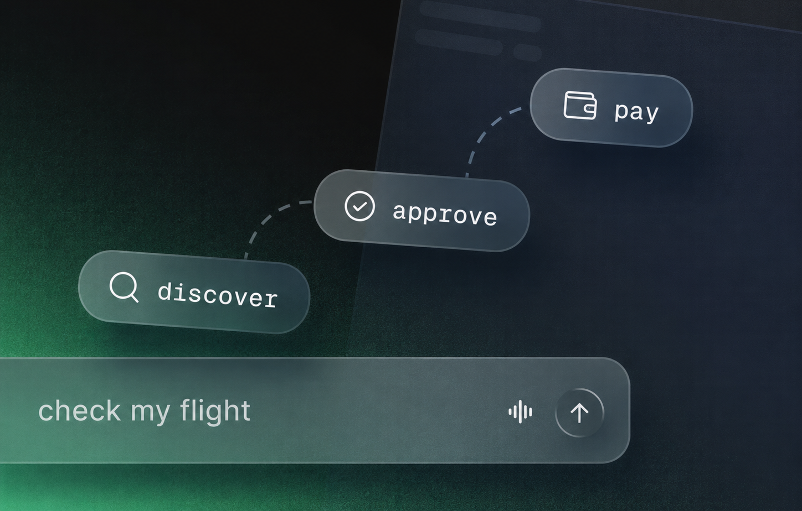

# Circle Payment Agent

An agent that owns a USDC wallet and pays for the services it calls. It searches the [Circle Agent Marketplace](https://agents.circle.com/services) for something that can answer your question, checks the price, waits for you to approve the spend, then settles per call without any API key or account signup. Built with [Mastra](https://mastra.ai) and the [Circle Agent Stack](https://developers.circle.com/agent-stack).

## Why we built this

Agents hit walls that have nothing to do with reasoning: a paywall, a missing API key, a rate limit. The usual fix is a human going off to sign up for something. This template removes that step. The agent holds funds and settles per call, so "I can't access that" turns into a purchase decision instead of a dead end.

It is also a practical use of Mastra primitives that are hard to show off with a read-only agent:

- **Tools that spend real money.** Seventeen tools wrapping the Circle CLI: wallet creation and deployment, balances, Gateway deposits, fiat top-ups, USDC transfers, service discovery, and paid calls.
- **Suspend and resume as an approval gate.** The three tools that move USDC are marked `requireApproval`, so Mastra suspends the run before any of them executes and Studio shows you the pending call to approve or decline.
- **Instructions fetched at runtime.** The agent's own instructions are a bootstrap plus two house rules: never authenticate as the user, never spend outside the approval gate. There is no authored playbook. On its first turn it fetches Circle's own [setup skill](https://agents.circle.com/skills/setup.md) and follows that, so the template keeps working as the marketplace changes underneath it.

## Demo

This demo runs in Mastra Studio, but you can connect this agent to your React, Next.js, or Vue app using the [Mastra Client SDK](https://mastra.ai/docs/server/mastra-client) or agentic UI libraries like [AI SDK UI](https://mastra.ai/guides/build-your-ui/ai-sdk-ui), [CopilotKit](https://mastra.ai/guides/build-your-ui/copilotkit), or [Assistant UI](https://mastra.ai/guides/build-your-ui/assistant-ui).

## Prerequisites

- [Circle CLI](https://developers.circle.com/agent-stack/circle-cli/command-reference): `npm install -g @circle-fin/cli`
- A Circle account. You log in and accept Circle's Terms of Use yourself, in your own terminal, because an agent must never accept them for you.
- An [OpenAI API key](https://platform.openai.com/api-keys): used by default, but you can swap in any model

## Quickstart 🚀

1. **Clone the template**
   - Run `npx create-mastra@latest --template circle-payment-agent` to scaffold the project locally.
2. **Log in to Circle**
   - Run `circle wallet login`, then `circle wallet status` to confirm the session and accept the Terms of Use if you have not already.
3. **Add your API keys**
   - Copy `.env.example` to `.env` and fill in your keys.
4. **Start the dev server**
   - Run `npm run dev` and open [localhost:4111](http://localhost:4111) to try it out.

## Using it

Ask for what you want in plain language:

- `what services are available for weather data?`
- `check flight WN2417 with FlightAware`
- `top up my wallet with testnet USDC`
- `send 5 USDC on Base to 0x…`

The agent finds a candidate service, inspects its price, and picks a payment chain. When it is ready to spend, the run pauses: Studio shows the suspended call with the service, the chain, and the exact amount, and nothing is charged until you resume it. Decline and the agent goes looking for another way.

## Making it yours

Change the model in `src/mastra/agents/circle-payment-agent.ts` — any model Mastra can route to works. Beyond that, change the approval policy, or point the agent at your own endpoint: any x402-compatible service works, not just the marketplace, since the paid-call tool takes a URL, a method, and a payload. For a hard ceiling that holds even if the agent misbehaves, set per-transaction and daily caps on the wallet itself with `circle wallet policy`. The same wallet can also list a service of your own on the marketplace and collect per call. The agent and tools are all in `src/`, so edit them directly to fit your use case.

## About Mastra templates

[Mastra templates](https://mastra.ai/templates) are ready-to-use projects that show off what you can build — clone one, poke around, and make it yours. They live in the [Mastra monorepo](https://github.com/mastra-ai/mastra) and are automatically synced to standalone repositories for easier cloning.

Want to contribute? See [CONTRIBUTING.md](./CONTRIBUTING.md).

## Attribution

The Circle CLI integration in `src/mastra/circle/` is adapted from Circle's [agent-stack-starter-kits](https://github.com/circle-fin/agent-stack-starter-kits), used under the Apache License 2.0.
