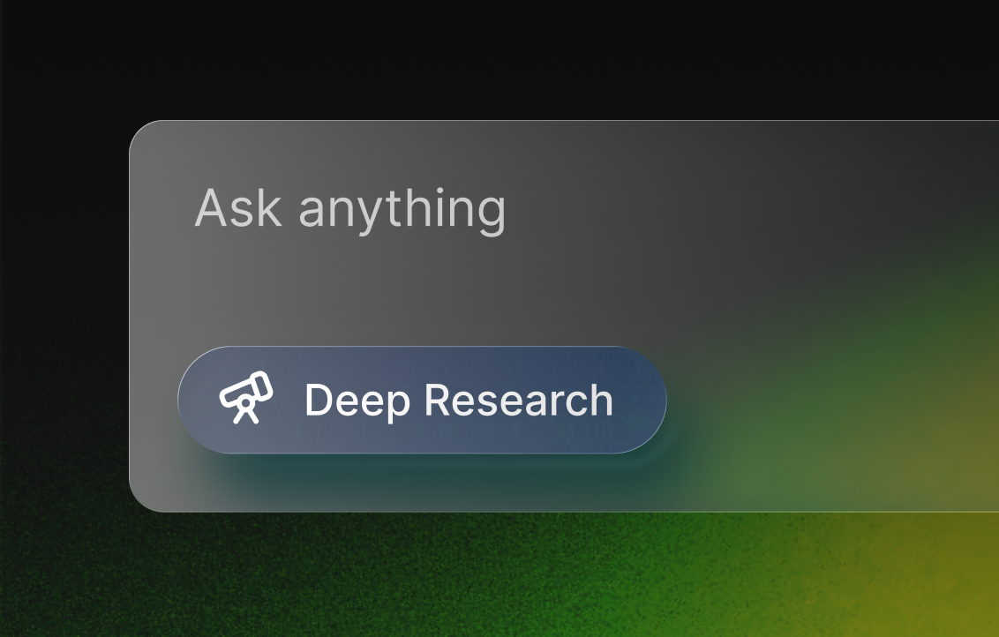

# Deep Search

An AI research assistant that evaluates its own work. It searches, checks if the results actually answer your question, identifies what's missing, and keeps going until it gets there. Uses [Exa](https://exa.ai) for web search and page scraping. Inspired by OpenAI's deep research and Perplexity. Built with [Mastra](https://mastra.ai).

## Why we built this

This template shows how Mastra's workflow primitives and agent orchestration come together: nested workflows, suspend/resume for human input, and multiple specialized agents coordinating on a single task.

## Demo

https://github.com/user-attachments/assets/dfea59c3-8038-461c-a4b4-504f8fc01575

This demo runs in Mastra Studio, but you can connect this workflow to your React, Next.js, or Vue app using the [Mastra Client SDK](https://mastra.ai/docs/server/mastra-client) or agentic UI libraries like [AI SDK UI](https://mastra.ai/guides/build-your-ui/ai-sdk-ui), [CopilotKit](https://mastra.ai/guides/build-your-ui/copilotkit), or [Assistant UI](https://mastra.ai/guides/build-your-ui/assistant-ui).

## Quick start

```bash
npx create-mastra@latest --template deep-search
cd deep-search
```

Create a `.env` file:

```bash
OPENAI_API_KEY=sk-...
EXA_API_KEY=...
```

Run it:

```bash
npm run dev
```

This starts Mastra Studio at [localhost:4111](http://localhost:4111).

## Using it

1. Open Studio and trigger the `deep-search` workflow with your research question
2. The workflow asks a few clarifying questions — answer them and resume
3. Watch the console as it searches, evaluates, and iterates

```bash
generateQueries start    { initialQuery: "best espresso machine", gaps: 0 }
search query done        { results: 10 }
evaluateResults done     { answerIsSatisfactory: false, gaps: ["pricing"] }
generateQueries start    { gaps: 1 }
```

When it's satisfied, you get a sourced answer.

## About Mastra templates

[Mastra templates](https://mastra.ai/templates) are ready-to-use projects that show off what you can build — clone one, poke around, and make it yours. They live in the [Mastra monorepo](https://github.com/mastra-ai/mastra) and are automatically synced to standalone repositories for easier cloning.

Want to contribute? See [CONTRIBUTING.md](./CONTRIBUTING.md).
